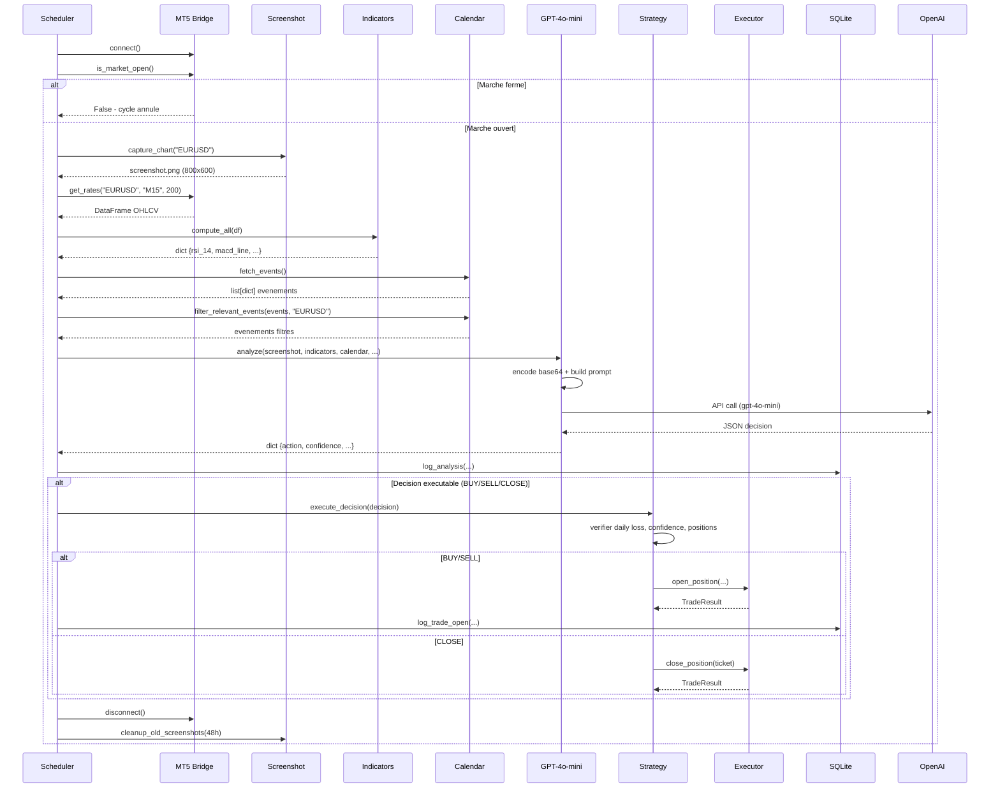

# Cycle d'analyse complet

Le bot execute un cycle d'analyse et de trading a intervalle regulier (configurable, 15 min par defaut). Voici le deroulement detaille de chaque cycle, tel qu'implante dans `src/scheduler/scheduler.py` (fonction `run_once()`).

## Diagramme du cycle



## Etape 1 : Capture d'ecran

**Fichier** : `src/mt5/screenshots.py` - fonction `capture_chart(symbol)`

Le bot prend un screenshot du graphique MT5 courant :

```python
result = mt5.screen_shot(str(filepath), 800, 600)
```

- Resolution : 800x600 pixels
- Format : PNG
- Stockage : `data/screenshots/{SYM}_{YYYYMMDD_HHMMSS}.png`
- Nettoyage automatique : les screenshots de plus de 48h sont supprimes

> **Note** : L'API Python MT5 n'a pas besoin que le terminal soit au premier plan. Le screenshot est pris en tache de fond.

## Etape 2 : Calcul des indicateurs

**Fichier** : `src/mt5/indicators.py` - fonction `compute_all(df)`

A partir d'un DataFrame pandas de 200 bougies OHLCV :

| Indicateur | Parametre | Formule |
|---|---|---|
| **RSI** | 14 periodes | RSI = 100 - (100 / (1 + RS)) avec RS = moyenne gains / moyenne pertes (EMA) |
| **MACD** | 12, 26, 9 | MACD Line = EMA 12 - EMA 26. Signal = EMA 9 de MACD. Histogramme = MACD - Signal |
| **SMA 20** | 20 periodes | Moyenne simple des 20 dernieres clotures |
| **SMA 50** | 50 periodes | Moyenne simple des 50 dernieres clotures |
| **Bollinger** | 20, 2 ecarts-types | SMA 20 +/- 2 * ecart-type. Position % = (prix - lower) / (upper - lower) |
| **ATR** | 14 periodes | Moyenne des True Ranges (EMA). TR = max(high-low, high-prev_close, low-prev_close) |
| **Tendance court terme** | - | "haussier" si prix > SMA 20, "baissier" sinon |
| **Tendance moyen terme** | - | "haussier" si prix > SMA 50, "baissier" sinon |

**Structure de retour** :

```python
{
    "rsi_14": 58.3,
    "macd_line": 0.00012,
    "macd_signal": 0.00008,
    "macd_histogram": 0.00004,
    "sma_20": 1.08450,
    "sma_50": 1.08210,
    "bb_upper": 1.08720,
    "bb_middle": 1.08450,
    "bb_lower": 1.08180,
    "bb_position_pct": 55.2,
    "atr_14": 0.00120,
    "current_price": 1.08480,
    "high_24h": 1.08650,
    "low_24h": 1.08100,
    "trend_short": "haussier",
    "trend_medium": "haussier"
}
```

## Etape 3 : Calendrier economique

**Fichier** : `src/data/calendar.py` - fonctions `fetch_events()` et `filter_relevant_events(events, symbol)`

1. Requete HTTP GET sur `https://www.forexfactory.com/calendar`
2. Parsing HTML avec BeautifulSoup (table `calendar__table`)
3. Extraction des colonnes : time, currency, event, impact, previous, forecast, actual
4. Filtrage : seuls les evenements HIGH et MEDIUM sont conserves, filtres par devise de la paire

**Exemple de retour** :

```python
[
    {
        "time": "08:30",
        "currency": "USD",
        "event": "Non-Farm Employment Change",
        "impact": "high",
        "previous": "243K",
        "forecast": "185K",
        "actual": ""
    }
]
```

En cas d'echec du scraping (site inaccessible, changement de structure HTML), la fonction retourne une liste vide et le bot continue sans donnees calendaires.

## Etape 4 : Analyse IA

**Fichier** : `src/ai/vision.py` - fonction `analyze(...)`

### Construction du prompt

Le prompt est construit dans `src/ai/prompts.py` via `build_analysis_prompt()`. Il contient :

- **Contexte** : paire, timeframe, prix actuel
- **Indicateurs** : valeurs formatees des indicateurs techniques
- **Calendrier** : evenements economiques filtres
- **Positions** : positions ouvertes et P&L
- **Instructions** : analyser le graphique + donnees, retourner JSON

### Appel API

```python
response = client.chat.completions.create(
    model="gpt-4o-mini",
    messages=[{
        "role": "user",
        "content": [
            {"type": "image_url", "image_url": {"url": f"data:image/png;base64,{image_b64}", "detail": "high"}},
            {"type": "text", "text": prompt},
        ],
    }],
    max_tokens=600,
    temperature=0.3,
)
```

- Modele : `gpt-4o-mini`
- Image encodee en base64, detail `high`
- Temperature 0.3 (faible, pour des decisions coherentes)
- Max tokens 600
- Retry automatique : 3 tentatives avec backoff exponentiel (via `tenacity`)

### Parsing de la reponse

```python
json_match = re.search(r"\{.*\}", raw, re.DOTALL)
decision = json.loads(json_match.group(0))
```

Validation des champs requis : `action`, `confidence`, `reasoning`, `stop_loss_pips`, `take_profit_pips`, `risk_level`.

Actions valides : `BUY`, `SELL`, `HOLD`, `CLOSE`.

**Exemple de decision JSON** :

```json
{
    "action": "BUY",
    "confidence": 78,
    "reasoning": "RSI a 42 remonte de zone survendue. MACD bullish cross confirme. Support a 1.0830 tient. Prix sous SMA 20 mais Bollinger suggere rebond.",
    "stop_loss_pips": 25,
    "take_profit_pips": 45,
    "risk_level": "MEDIUM"
}
```

## Etape 5 : Gestion des risques

**Fichier** : `src/ai/strategy.py` - fonction `execute_decision(decision)`

Verifications successives :

1. Marche ouvert ?
2. Compte et symbole accessibles ?
3. Limite de perte journaliere atteinte ? (max 3%)
4. Action CLOSE ? -> ferme toutes les positions
5. Confiance >= 70% ? (seuil configurable)
6. Nombre de positions ouvertes < max ?

Voir [Regles de gestion des risques](regles-gestion-risques.md) pour le detail.

## Etape 6 : Execution

**Fichier** : `src/mt5/executor.py`

- Calcul du volume : `calculate_position_size(balance, stop_loss_pips, symbol_info)`
- Calcul des prix SL/TP : ajustement par le point et digits du symbole
- Envoi de l'ordre : `mt5.order_send(request)` avec `ORDER_FILLING_IOC`
- Deviation maximale : 20 pips

## Etape 7 : Logging

**Fichier** : `src/data/database.py`

Deux entrees en base :

| Table | Donnees |
|---|---|
| **analysis_logs** | Timestamp, symbole, timeframe, decision complete, screenshot path, snapshot indicateurs et calendrier, flag executed |
| **trades** | Ticket, symbole, direction, volume, prix ouvert/fermeture, SL, TP, confidence, reasoning, profit |

Voir [Module Data](.../4-technique/backend/data-module.md) pour le detail des schemas.
