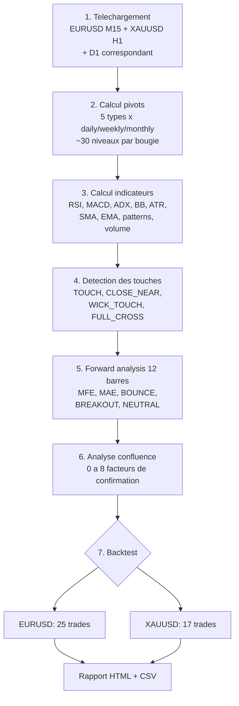

# Etude de la strategie de retournement sur points pivots

**Date** : 2026-06-25
**Periode analysee** : 2025-06-25 au 2026-06-25 (12 mois)
**Symboles** : EURUSD M15 + XAUUSD H1
**Script principal** : `scratch/pivot_study_v2.py`
**Backtest** : `scratch/pivot_backtest_v2.py`
**Rapport complet** : `data/pivot_analysis/RAPPORT_ANALYSE_PIVOTS.md`

---

## 1. Objectif de l'etude

Evaluer si les points pivots (Classic, Camarilla, Woodie, Fibonacci, CPR) peuvent servir de signaux de retournement exploitables dans une strategie de trading systematique. L'etude couvre :

- Le comportement statistique du prix au contact des niveaux pivots (rebond vs cassure).
- L'effet de la confluence multi-facteurs sur la qualite des signaux.
- Un backtest complet avec gestion des risques (SL, trailing, breakeven, time exit).

---

## 2. Methodologie

### 2.1 Donnees

- **EURUSD M15** : 14,481 bougies, 12 mois
- **XAUUSD H1** : 5,913 bougies, 12 mois
- Donnees D1 pour le calcul des pivots journaliers, reechantillonnees en weekly/monthly

### 2.2 Types de pivots calcules

| Type | Niveaux | Formule cle |
|---|---|---|
| Classic | PP, R1-R3, S1-S3 | PP = (H+L+C)/3 |
| Camarilla | PP, R1-R4, S1-S4 | Base sur C + 1.1x range |
| Woodie | PP, R1-R3, S1-S3 | PP = (H+L+2C)/4 |
| Fibonacci | PP, R1-R3, S1-S3 | Retracements 38.2/61.8/100% |
| CPR | PP, R1, S1, TC, BC | Zone TC-BC |

Chaque type est calcule en daily, weekly, et monthly. Seul le daily est aligne sur l'intraday dans l'etude actuelle.

### 2.3 Detection des contacts

Quatre types de contact sont detectes a chaque bougie :

- **TOUCH** : le high/low touche le niveau (meme tick).
- **CLOSE_NEAR** : le close est a moins de 0.5x ATR du niveau.
- **WICK_TOUCH** : la meche traverse le niveau mais le corps reste du cote oppose.
- **FULL_CROSS** : le corps traverse completement le niveau.

### 2.4 Forward analysis

Pour chaque contact detecte, on suit les 12 bougies suivantes et on mesure :

- **MFE** (Maximum Favorable Excursion) : mouvement max dans le sens favorable.
- **MAE** (Maximum Adverse Excursion) : mouvement max dans le sens adverse.
- **Outcome** : BOUNCE (retournement reussi), BREAKOUT (cassure), ou NEUTRAL.

### 2.5 Facteurs de confluence

8 facteurs sont evalues au moment du contact :

| Facteur | Condition haussiere | Condition baissiere |
|---|---|---|
| RSI | RSI < 30 (survendu) | RSI > 70 (surachete) |
| MACD | MACD > Signal | MACD < Signal |
| ADX | ADX > 20 (tendance) | ADX > 20 (tendance) |
| BB | Prix proche bande basse | Prix proche bande haute |
| SMA | Prix > SMA 20 | Prix < SMA 20 |
| Pattern | Chandelier haussier | Chandelier baissier |
| Volume | Volume > moyenne | Volume > moyenne |
| Multiple pivots | Confluence de niveaux | Confluence de niveaux |

---

## 3. Resultats principaux

### 3.1 Taux de rebond vs cassure

Le marche montre une **dominance des cassures** sur les rebonds :

| Metrique | EURUSD M15 | XAUUSD H1 |
|---|---|---|
| Evenements de contact | 23,556 | 19,132 |
| Taux de rebond moyen | 29-38% | 27-42% |
| Taux de cassure moyen | 41-50% | 33-54% |
| Taux neutre | 20-25% | 15-25% |

**Interpretation** : Les points pivots ne sont pas des barrieres magiques. Dans ~60-70% des cas, le prix continue a traverser le niveau plutot que de rebondir.

### 3.2 Niveaux les plus reactifs

Les niveaux extremes offrent les meilleurs taux de rebond, mais avec trop peu de contacts pour une strategie fiable.

**EURUSD M15** :

| Niveau | Contacts | Rebond% | Break% |
|---|---|---|---|
| Monthly PP | 17 | 58.8% | 29.4% |
| Camarilla S3 | 975 | 38.7% | 41.3% |
| Classic R3 | 81 | 37.0% | 23.5% |
| Camarilla R1 | 1,456 | 37.6% | 42.9% |

**XAUUSD H1** :

| Niveau | Contacts | Rebond% | Break% |
|---|---|---|---|
| Monthly S3 | 20 | 60.0% | 25.0% |
| Monthly R3 | 45 | 51.1% | 33.3% |
| Classic S2 | 133 | 42.1% | 51.1% |
| Weekly R2 | 111 | 39.6% | 47.7% |

### 3.3 Effet de la confluence

**La confluence multi-facteurs n'ameliore pas significativement le win rate.** Accumuler des confirmations (RSI + MACD + patterns + BB + volume) reduit drastiquement le nombre de trades sans ameliorer leur qualite.

**EURUSD** :

| Facteurs | Touches | Win Rate |
|---|---|---|
| 0 | 3,449 | 30.2% |
| 2 | 7,052 | 31.6% |
| 4 | 1,447 | 31.4% |
| 6 | 22 | 18.2% |

**XAUUSD** :

| Facteurs | Touches | Win Rate |
|---|---|---|
| 0 | 4,011 | 34.7% |
| 2 | 5,150 | 33.1% |
| 4 | 550 | 25.6% |
| 5 | 90 | 43.3% |

### 3.4 Resultats du backtest

**EURUSD (sans filtre tendance)** :

| Metrique | Valeur |
|---|---|
| Trades | 25 |
| Win Rate | 40.0% |
| Profit Factor | 0.91 |
| Sharpe Ratio | -0.51 |
| Max Drawdown | 2.28% |
| Return | -0.43% |

**XAUUSD (sans filtre tendance)** :

| Metrique | Valeur |
|---|---|
| Trades | 17 |
| Win Rate | 64.7% |
| Profit Factor | 4.80 |
| Sharpe Ratio | 8.81 |
| Max Drawdown | 1.55% |
| Return | +6.16% |

**Avec filtre EMA 200** : 0 trades sur les deux symboles. Le filtre est trop restrictif.

---

## 4. Diagnostic

1. **SL trop serre** : 100% des sorties sont des SL. Le stop loss a 1.5x ATR est touche avant que le TP (niveau pivot suivant) ne soit atteint.
2. **Trop peu de trades** : 25/17 trades en 12 mois (~2 trades/mois), economiquement non viable.
3. **Taux de rebond insuffisant** : 25-39% de rebond signifie que les pivots ne sont pas exploitables comme signaux de retournement isoles.
4. **Les cassures dominent** : Le marche casse les pivots 40-50% du temps. Une strategie de breakout serait peut-etre plus adaptee.
5. **La confluence est inutile** : Accumuler des confirmations techniques classiques ne fait que reduire le nombre de trades sans ameliorer la qualite.

---

## 5. Recommandations

1. **Trader les cassures, pas les rebonds** : avec 40-50% de breakouts vs 25-39% de bounces, le sens dominant est la cassure. Une strategie de breakout avec retest serait plus coherente.
2. **Niveaux extremes uniquement** : R3/S3 (Classic) ou R4/S4 (Camarilla) montrent des taux de rebond superieurs. Filtrer pour ne trader QUE ces niveaux.
3. **XAUUSD > EURUSD** : L'or offre des mouvements plus amples et un meilleur ratio. Le forex est trop bruite en M15.
4. **Time Exit obligatoire** : utiliser un time exit (12-24 barres) avec trailing stop large plutot que d'attendre un SL/TP base sur les niveaux.
5. **Changer de timeframe** : Le M15 est peut-etre trop bruite. Tester en H1 pour EURUSD aussi.
6. **Role des pivots** : le meilleur usage des points pivots est comme **filtre additionnel** dans une strategie plus large (ex: ne pas shorter pres d'un support, ne pas longer pres d'une resistance), plutot que comme signal d'entree principal.

---

## 6. Fichiers generes

| Fichier | Contenu |
|---|---|
| `data/pivot_study_events_eurusd.csv` | 23,556 evenements de contact EURUSD |
| `data/pivot_study_events_xauusd.csv` | 19,132 evenements de contact XAUUSD |
| `data/pivot_study_summary_eurusd.csv` | Synthese par niveau/pivot EURUSD |
| `data/pivot_study_summary_xauusd.csv` | Synthese par niveau/pivot XAUUSD |
| `data/pivot_study_confluence_eurusd.csv` | Analyse de confluence EURUSD |
| `data/pivot_study_confluence_xauusd.csv` | Analyse de confluence XAUUSD |
| `data/pivot_study_distribution_eurusd.csv` | Distribution MFE/MAE EURUSD |
| `data/pivot_study_distribution_xauusd.csv` | Distribution MFE/MAE XAUUSD |
| `data/pivot_study_report_eurusd.html` | Rapport HTML EURUSD |
| `data/pivot_study_report_xauusd.html` | Rapport HTML XAUUSD |
| `data/pivot_backtest_trades_*.csv` | Trades du backtest |
| `data/pivot_backtest_equity_*.csv` | Courbes d'equite |
| `data/pivot_backtest_summary.json` | Resume du backtest |
| `data/pivot_analysis/RAPPORT_ANALYSE_PIVOTS.md` | Rapport complet |

---

## 7. Conclusion

Les points pivots sont des references techniques utiles pour le contexte de marche, mais utilises isolement comme signaux de retournement, ils ne fournissent pas un edge statistique suffisant pour une strategie de trading systematique.

Le taux de rebond de 25-39% est trop proche de l'aleatoire pour etre exploitable. L'ajout d'indicateurs de confirmation (RSI, MACD, patterns) n'ameliore pas significativement la qualite des signaux.

**Piste interessante** : les niveaux extremes (R3/S3 Classic, R4/S4 Camarilla) et les pivots mensuels montrent des taux de rebond superieurs (37-60%). Une strategie focalisee exclusivement sur ces niveaux, avec un time exit et un SL large (3x ATR), meriterait d'etre testee.
