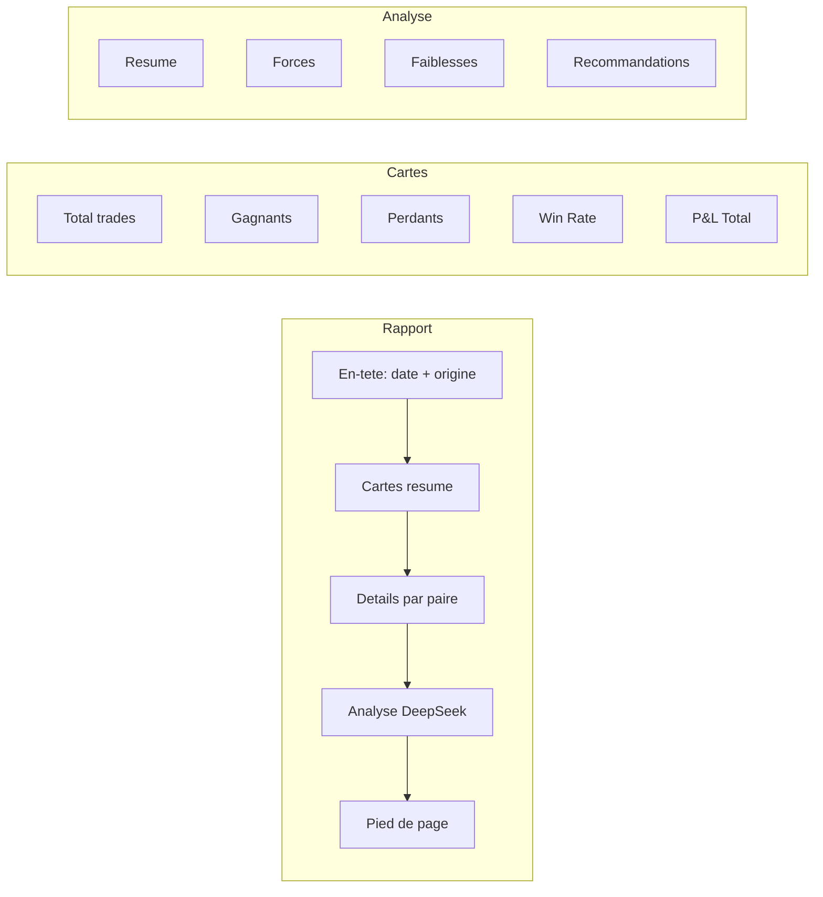

# Rapport quotidien par email

Le bot genere et envoie automatiquement un rapport journalier par email a 23:00 UTC. Ce rapport consolide tous les trades de la journee, calcule des statistiques de performance, et inclut une analyse approfondie generee par DeepSeek V4 Pro.

## Objectif

Fournir un resume quotidien clair et actionnable des performances du bot, sans avoir a se connecter au serveur ou a consulter les logs. L'analyse DeepSeek identifie les patterns, forces, faiblesses et suggere des ameliorations concretes.

## Contenu du rapport



### 1. Cartes resume

Blocs visuels affichant les indicateurs cles de la journee :

| Indicateur | Description |
|---|---|
| **Total trades** | Nombre total de trades (ouverts + fermes) |
| **Gagnants** | Trades avec profit > 0 (vert) |
| **Perdants** | Trades avec profit <= 0 (rouge) |
| **Win Rate** | Pourcentage de trades gagnants |
| **P&amp;L Total** | Profit/Perte net de la journee en dollars (vert si positif, rouge si negatif) |

Une ligne secondaire affiche : meilleur trade, pire trade, profit moyen, duree moyenne des trades, confiance moyenne.

### 2. Details par paire

Une section par paire de devises (EURUSD, GBPUSD, XAUUSD, etc.) avec :

- **Mini-statistiques** : nombre de trades, gagnants/perdants, win rate, P&amp;L, profit moyen, duree moyenne
- **Tableau des trades** : heure d'ouverture, direction (BUY/SELL), volume, prix d'entree, P&amp;L

Les paires sans trade du jour sont ignorees.

### 3. Analyse DeepSeek V4 Pro

DeepSeek V4 Pro analyse les resultats et produit une analyse en francais structuree en 4 sections :

| Section | Questions abordees |
|---|---|
| **Resume** | Performance globale du jour. Positif ou negatif ? Tendance ? |
| **Forces** | Quelles paires ont performe ? Quels patterns ont fonctionne ? A quel moment de la journee ? |
| **Faiblesses** | Quelles pertes ? Y a-t-il un pattern recurrent dans les echecs ? Erreurs potentielles ? |
| **Recommandations** | Faut-il ajuster les parametres ? Eviter certaines paires ou horaires ? Modifier la gestion du risque ? |

L'analyse est honnete et directe. Si les resultats sont mauvais, elle le dit clairement.

### 4. Sujet de l'email

Le sujet est dynamique et inclut les indicateurs cles :

```
Rapport Trading 01/06/2026 | 8 trades | P&amp;L: +42.50 $ | WR: 62.5%
```

Cela permet d'evaluer la journee d'un coup d'oeil sans ouvrir l'email.

## Horaire d'envoi

Le rapport est envoye automatiquement a **23:00 UTC** chaque jour (configurable).

Cela correspond a :
- 01:00 heure de Paris (ete, UTC+2)
- 00:00 heure de Paris (hiver, UTC+1)
- 19:00 heure de New York (UTC-4)

Le creneau de 23:00 UTC est choisi car il se situe apres la fermeture de New York (22:00 UTC) et avant l'ouverture de la session Asiatique. Tous les trades de la journee de trading sont normalement termines.

## Destinataire

Configure par defaut sur `dialloabdoul99c@gmail.com`. Modifiable via `REPORT_RECIPIENT_EMAIL` dans le `.env`.

Un nom de destinataire optionnel (`REPORT_RECIPIENT_NAME`) peut etre ajoute pour personnaliser l'email.

## Design de l'email

- **Theme** : Dark mode (fond sombre `#020617`, cartes `#0f172a`)
- **Responsive** : S'adapte aux ecrans mobile et desktop (max-width 680px)
- **Palette** : Vert (`#22c55e`) pour les gains, rouge (`#ef4444`) pour les pertes, gris (`#94a3b8`) pour le texte secondaire
- **Typographie** : System font stack (-apple-system, BlinkMacSystemFont, Segoe UI, Roboto)

## Cas particuliers

| Cas | Comportement |
|---|---|
| **Aucun trade du jour** | Rapport envoye avec le message "Aucun trade aujourd'hui" |
| **Cle DeepSeek absente** | Analyse remplacee par "_Analyse DeepSeek non disponible_" |
| **Cle Mailer absente** | Erreur logguee, email non envoye |
| **Rate limit API mailer** | 3 tentatives avec backoff exponentiel |
| **Base de donnees vide** | Rapport envoye sans trades ni stats |
| **Une seule paire avec trades** | Rapport normal, une seule carte "Details par Paire" |

## Test manuel

```powershell
# Envoyer le rapport du jour
python scripts/send_report.py

# Envoyer le rapport d'une date passee
python scripts/send_report.py 2026-05-30
```

## Configuration

| Variable | Defaut | Description |
|---|---|---|
| `MAILER_API_SECRET` | _(requis)_ | Cle API pour `mailing.weltaare-tech.com` |
| `MAILER_API_URL` | `https://mailing.weltaare-tech.com/api/v1/emails` | URL de l'API d'envoi |
| `REPORT_RECIPIENT_EMAIL` | `dialloabdoul99c@gmail.com` | Destinataire du rapport |
| `REPORT_RECIPIENT_NAME` | _(vide)_ | Nom du destinataire (optionnel) |
| `REPORT_SENDER_NAME` | `Trading Bot MT5` | Nom de l'expediteur dans l'email |
| `REPORT_SEND_HOUR_UTC` | `23` | Heure d'envoi UTC (0-23) |
| `REPORT_SEND_MINUTE_UTC` | `0` | Minute d'envoi UTC (0-59) |

Voir [Configuration](../4-technique/configuration.md) et [Module Rapports](../4-technique/backend/rapport-journalier.md) pour les details techniques.
