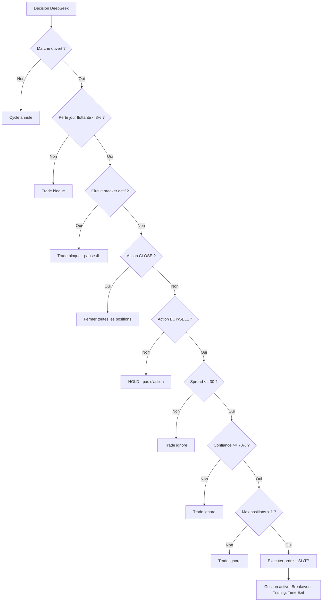

# Regles de gestion des risques

La gestion des risques est le coeur du bot. Elle est implantee dans `src/ai/strategy.py` (fonction `execute_decision()`) et appliquee **avant chaque execution** d'ordre.

## Regles appliquees



### 1. Marche ouvert

**Fichier** : `src/mt5/bridge.py` - fonction `is_market_open()`

```python
def is_market_open() -> bool:
    selected = mt5.symbol_select(sym, True)
    info = mt5.symbol_info(sym)
    return info.trade_time != 0
```

- Verifie que le symbole est disponible dans MarketWatch
- Verifie que le trading est autorise (weekend, jours feries, overnight)

### 2. Limite de perte journaliere

**Regle** : Perte maximale de **3% du capital** par jour.

```python
daily_pnl = _get_daily_pnl()
daily_loss_pct = abs(daily_pnl) / balance * 100
if daily_loss_pct >= max_daily_loss_pct:  # 3%
    logger.warning("LIMITE PERTE JOURNALIERE ATTEINTE")
    return  # Aucun trade
```

- Calcule le P&L du jour depuis la table `trades` (SUM des profits des trades fermes aujourd'hui)
- Si la limite est atteinte, **tous les trades sont bloques** jusqu'au jour suivant
- Configurable via `MAX_DAILY_LOSS_PCT` dans le `.env`

### 3. Confiance minimale

**Regle** : Ne trader que si la confiance de l'IA est >= **70%**.

```python
if confidence < settings.min_confidence_threshold:  # 70
    logger.info(f"Confiance {confidence}% < seuil {min_confidence}%")
    return
```

- Les actions BUY/SELL avec confidence < 70% sont ignorees
- Les actions HOLD et CLOSE ne sont pas concernees par cette regle
- Configurable via `MIN_CONFIDENCE_THRESHOLD`

### 4. Nombre maximum de positions

**Regle** : Maximum **1 position ouverte** a la fois.

```python
if count_open_positions() >= settings.max_open_positions:  # 1
    logger.info("Max positions atteint")
    return
```

- Evite le sur-trading et la concentration de risque
- Configurable via `MAX_OPEN_POSITIONS`

### 5. Risque maximum par trade

**Regle** : Ne pas risquer plus de **1% du capital** par trade.

```python
risk_amount = account_balance * (risk / 100)  # risk = 1%
volume = risk_amount / (sl_price_distance * point_value / pip_size * 10)
volume = max(0.01, round(volume, 2))
```

- Le volume (lots) est calcule automatiquement en fonction de la distance du stop loss
- Plus le SL est serre, plus le volume peut etre eleve (et vice versa)
- Configurable via `MAX_RISK_PER_TRADE_PCT`

### 6. Stop loss obligatoire

**Regle** : Tout ordre BUY/SELL doit avoir un **stop loss** defini.

- Aucun trade n'est execute sans SL
- Le SL est fourni par l'IA dans la decision (`stop_loss_pips`)
- Fourchette recommandee : 15-50 pips selon la volatilite
- Le SL est converti en prix absolu en fonction du `point` et `digits` du symbole

### 7. Take profit minimum

**Regle** : Le take profit doit etre au moins **1.5 fois** le stop loss.

- Applique dans le prompt IA (instruction donnee a GPT-4o-mini)
- Garantit un ratio risque/recompense (R/R) d'au moins 1:1.5
- Exemple : SL a 20 pips -> TP minimum a 30 pips

### 8. Ordre CLOSE

**Regle** : Si l'IA decide CLOSE, **toutes** les positions ouvertes sont fermees.

```python
if action == "CLOSE":
    for pos in get_open_positions():
        close_position(pos["ticket"])
```

- Utile en cas de retournement de tendance ou d'evenement economique majeur
- Ne tient pas compte de la confiance (CLOSE est toujours execute)

### 9. Filtre de spread (v1.1)

**Regle** : Ne pas ouvrir de trade si le spread depasse **30 points** (3 pips sur EURUSD).

- Applique dans `_passes_trade_filters()`
- Evite de trader pendant les periodes de faible liquidite

### 10. Circuit breaker (v1.1)

**Regle** : Apres **4 pertes consecutives**, pause de **4 heures**.

- Implante via `_count_consecutive_losses()` et `_circuit_breaker_active()`
- Etat persiste dans la table `bot_state` (survit aux redemarrages)

### 11. Limite de perte flottante (v1.1)

**Regle** : La perte journaliere inclut les pertes **flottantes** (positions ouvertes non fermees).

- `_get_daily_pnl()` somme les trades fermes + `mt5.positions_get()` floating P&L
- Evite d'ouvrir un nouveau trade quand le compte est deja en drawdown

### 12. Reconciliation automatique des trades (v1.1)

**Regle** : A chaque cycle, le bot detecte les positions fermees par SL/TP dans MT5.

- `reconcile_closed_positions()` dans le scheduler
- Met a jour la table `trades` (closed_at, close_price, profit)

### 13. Blocage news HIGH impact (v1.1)

**Regle** : Si une news HIGH impact est prevue, le cycle saute l'execution.

- `_has_high_impact_news_soon()` verifie les evenements du calendrier
- Protege contre la volatilite extreme (NFP, CPI, decisions de taux)

## Tableau recapitulatif

| Regle | Valeur | Fichier | Configurable |
|---|---|---|---|
| Risque max par trade | 1% du capital | `executor.py` | `MAX_RISK_PER_TRADE_PCT` |
| Perte journaliere max | 3% du capital (realise + flottant) | `strategy.py` | `MAX_DAILY_LOSS_PCT` |
| Positions max | 1 | `strategy.py` | `MAX_OPEN_POSITIONS` |
| Confiance minimale | 70% | `strategy.py` | `MIN_CONFIDENCE_THRESHOLD` |
| Stop loss | Obligatoire | `executor.py` | Non (fourni par IA) |
| Take profit | >= 1.5x SL | `vision.py` (validation) | Non |
| Deviation max | 20 pips | `executor.py` | Non (hardcode) |
| Magic number | Configurable | `executor.py` | `MT5_MAGIC_NUMBER` |
| Spread max | 30 points | `strategy.py` | Non (hardcode) |
| Circuit breaker | 4 pertes consecutives / 4h pause | `strategy.py` | Non (hardcode) |
| Reconciliation | A chaque cycle | `scheduler.py` | Non |
| News HIGH impact | Bloque execution | `scheduler.py` | Non |
