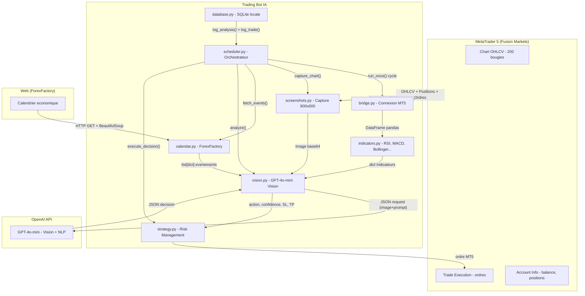
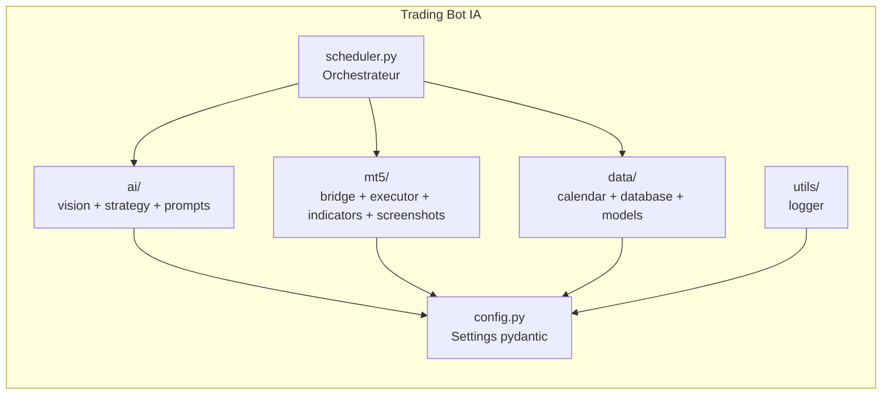
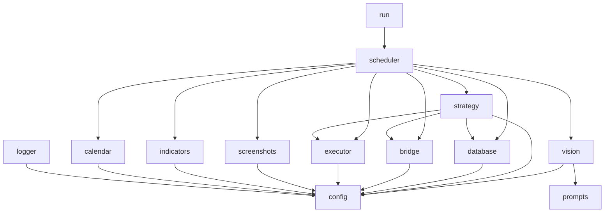

# Architecture globale

## Diagramme C4 - Niveau 1 (Contexte Systeme)

## Description des systemes

### MetaTrader 5 (Fusion Markets)

Plateforme de trading CFD/Forex. Le bot s'y connecte via l'API Python `MetaTrader5`.

- **Chart OHLCV** : fournit les donnees de prix historiques (Open, High, Low, Close, Volume)
- **Trade Execution** : recoit et execute les ordres BUY/SELL/CLOSE
- **Account Info** : expose le solde, les positions ouvertes, les proprietes des symboles

### Trading Bot IA

Application Python autonome decoupee en 6 modules. Voir les sections ci-dessous.

### OpenAI API

Service cloud GPT-4o-mini Vision qui analyse le screenshot et les donnees structurees pour produire une decision JSON.

### ForexFactory

Site web de calendrier economique. Scrape a chaque cycle pour recuperer les evenements a fort impact.

## Diagramme C4 - Niveau 2 (Conteneurs)

## Modules internes

### `src/config.py`

Configuration centralisee via `pydantic-settings`. Charge le fichier `.env` et expose les parametres sous forme de proprietes type-safe (voir [Configuration](../4-technique/configuration.md)).

### `src/mt5/` - Bridge MT5

| Fichier | Responsabilite |
|---|---|
| `bridge.py` | Connexion/deconnexion MT5, recuperation OHLCV, infos compte et symbole |
| `executor.py` | Ordres de trading (ouverture, fermeture), calcul de volume, position sizing |
| `indicators.py` | Calcul des indicateurs techniques (RSI, MACD, Bollinger, ATR, SMA) |
| `screenshots.py` | Capture d'ecran du graphique, nettoyage des fichiers obsoletes |

### `src/ai/` - Intelligence Artificielle

| Fichier | Responsabilite |
|---|---|
| `vision.py` | Appel API GPT-4o-mini Vision, encodage base64, parsing JSON, validation |
| `strategy.py` | Moteur de strategie : verification des regles de risque, execution |
| `prompts.py` | Construction du prompt envoye a l'IA |

### `src/data/` - Donnees

| Fichier | Responsabilite |
|---|---|
| `calendar.py` | Scraping ForexFactory, filtrage par devise |
| `database.py` | Connexion SQLite singleton, creation des tables, fonctions CRUD |
| `models.py` | Dataclasses `Trade` et `AnalysisLog` |

### `src/scheduler/scheduler.py`

Orchestrateur principal. Contient `run_once()` (cycle unique) et `run_forever()` (boucle infinie).

### `src/utils/logger.py`

Configuration du logger Loguru avec sortie console coloree et fichier avec rotation.

## Arbre des dependances

