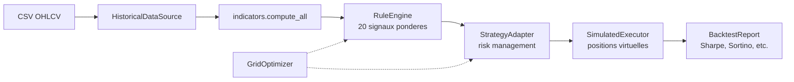

# ADR-002 : Backtesteur hybride avec RuleEngine de scoring

**Statut** : Accepte

**Date** : 2026-06-02

**Contexte** : Le trading bot repose sur GPT-4o-mini (OCR visuel) et DeepSeek V4 Pro (decision) pour analyser les charts et generer des signaux de trading. Pour valider les strategies avant de les deployer en live, un backtesteur est necessaire. Cependant, rejouer les appels IA reels dans une boucle de backtesting poserait trois problemes majeurs :

1. **Cout prohibitif** : avec ~96 appels IA par jour et 6 symboles, rejouer 12 mois d'historique representerait $200 a $500+ par mois en frais API.
2. **Non-reproductibilite** : les reponses d'un LLM ne sont pas deterministes (meme avec temperature=0), rendant les resultats de backtest non comparables entre deux executions.
3. **Latence** : chaque appel prend 2-5s, rendant un backtest multi-mois impraticable (des heures d'execution).

**Decision** : Utiliser un **RuleEngine** deterministe base sur un scoring pondere multi-signaux qui reproduit le raisonnement que l'IA ferait a partir des memes indicateurs techniques.

**Details techniques** :

- Le `RuleEngine` prend en entree le dictionnaire d'indicateurs produit par `src/mt5/indicators.compute_all()` (le meme que celui envoye a DeepSeek en production).
- Il evalue **20 signaux** repartis en 7 categories (tendance, momentum, force, volatilite, pivots, patterns chandeliers, structure de marche + contexte H1).
- Chaque signal recoit un poids (positif = haussier, negatif = baissier), configurable via `weights.yaml`.
- Si le score net depasse le seuil `buy_threshold` (defaut: 25), le signal est BUY ; en dessous de `-sell_threshold`, SELL ; sinon HOLD.
- Les regles de risk management (`StrategyAdapter`) restent identiques a la production car elles sont deja deterministes.
- Les ordres sont simules virtuellement via `SimulatedExecutor` (pas de connexion MT5).

**Architecture du backtesteur** :

**Alternatives considerees** :

| Alternative | Pour | Contre | Verdict |
|---|---|---|---|
| **Replay IA complet** | Fidelite parfaite au comportement reel | Cout $200-500+/mois, non-reproductible, lent | Rejete |
| **Regles purement indicatrices** | Simple, gratuit | Trop simpliste : ne reflete pas la richesse de l'analyse IA multi-signaux | Rejete |
| **Hybride AI-sampled** | Bon compromis cout/fidelite | Complexe a implementer, besoin de cache IA, toujours non-reproductible | Rejete |
| **RuleEngine pondere (choisi)** | Gratuit, rapide, reproductible, configurable | Ne replique pas parfaitement le comportement IA | Accepte |

**Consequences** :

- **Positives** :
  - Backtest gratuit (pas de cout API).
  - Execution rapide (quelques secondes pour plusieurs mois de donnees).
  - Resultats 100% reproductibles (deterministes).
  - Parametres ajustables via `weights.yaml` et grid search.
  - Valide la strategie sous-jacente independamment des hallucinations IA.

- **Negatives** :
  - Ne capture pas les intuitions visuelles de l'OCR (patterns graphiques complexes, nuances de price action).
  - Ne modelise pas les biais ou hallucinations de l'IA (qui peuvent parfois etre benefiques ou nefastes).
  - La performance en backtest peut differer de la performance live avec IA.

- **Neutres** :
  - Le RuleEngine est un complement au backtest, pas un remplacement de l'IA en production.
  - Les poids par defaut sont des heuristiques ; ils doivent etre optimises par grid search pour chaque symbole.
  - Le backtesteur peut etre utilise pour filtrer les mauvaises configurations avant de les tester en demo avec l'IA.

**Suivi** : Revoir cette decision si :
- L'IA devient significativement moins chere (ex: modele local performant).
- Le RuleEngine devie trop de la performance live reelle (mesurer l'ecart backtest vs demo).
- Un nouveau modele d'IA devient deterministe a temperature=0.
