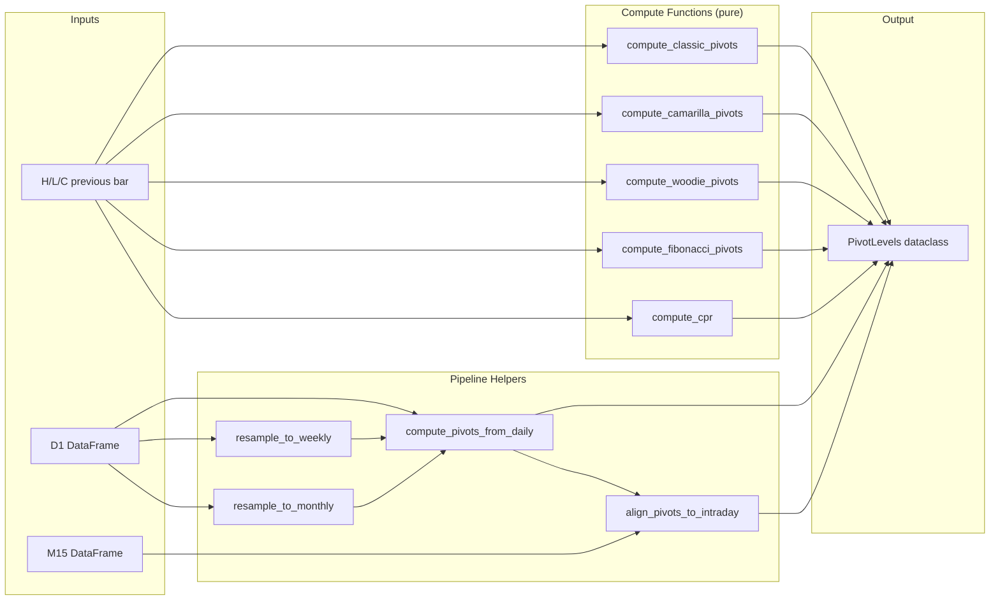

# ADR-005 : Module de points pivots multi-timeframe

**Statut** : Accepte

**Date** : 2026-06-25

**Contexte** : Le trading bot utilise deja des points pivots calcules dans `src/mt5/indicators.py`, mais uniquement en Classic daily pour le symbole courant. Pour evaluer rigoureusement la strategie de retournement sur pivots, nous avons besoin de :

1. **5 types de pivots** : Classic, Camarilla, Woodie, Fibonacci, et Central Pivot Range (CPR).
2. **3 timeframes superieures** : Daily, Weekly, Monthly.
3. **Alignement intraday** : merger les niveaux daily/weekly/monthly sur chaque bougie M15/H1.
4. **Calcul forward** : utiliser la veille (et non le jour meme) pour eviter le look-ahead bias.
5. **API reutilisable** : les memes fonctions doivent etre utilisables depuis les scripts d'etude (`scratch/`) et potentiellement depuis le bot live.

Le code existant dans `indicators.py` est integre au pipeline MT5 et n'expose pas ces capacites de maniere autonome.

**Decision** : Creer un module dedie `src/pivots/` contenant :

- `src/pivots/types.py` : dataclass `PivotLevels` + 5 fonctions de calcul pures (prennent H/L/C en entree, retournent un `PivotLevels`).
- `src/pivots/__init__.py` : re-export de l'API publique.

Les fonctions de calcul sont pures (sans dependance a MT5 ou a pandas) pour faciliter les tests unitaires et la reutilisation.

**Architecture du module** :



**Design du `PivotLevels`** :

```python
@dataclass
class PivotLevels:
    pp: float
    r1: float; s1: float
    r2: float; s2: float
    r3: float; s3: float
    r4: Optional[float] = None   # Camarilla only
    s4: Optional[float] = None   # Camarilla only
    tc: Optional[float] = None   # CPR Top Central
    bc: Optional[float] = None   # CPR Bottom Central
```

- Les champs `r4/s4` sont remplis uniquement par Camarilla.
- Les champs `tc/bc` sont remplis uniquement par CPR.
- Les champs `None` sont ignores par `all_levels()`, `nearest_support()`, etc.
- Les helpers `nearest_support(price)` et `nearest_resistance(price)` facilitent les requetes de proximite.

**Alternatives considerees** :

| Alternative | Pour | Contre | Verdict |
|---|---|---|---|
| **Etendre `indicators.py`** | Centralise | Couplage MT5, difficile a tester, API non reutilisable hors live | Rejete |
| **Librairie externe (TA-Lib, etc.)** | Standard | Ne supporte pas Camarilla/CPR nativement, dependance lourde | Rejete |
| **Module autonome `src/pivots/` (choisi)** | Testable, reutilisable, pur, extensible | Module supplementaire a maintenir | Accepte |

**Consequences** :

- **Positives** :
  - Fonctions pures testables independamment de MT5.
  - Reutilisables dans les backtests, etudes statistiques, et potentiellement le bot live.
  - API unifiee : un seul type de donnees (`PivotLevels`) pour tous les types de pivots.
  - Separation claire : `indicators.py` pour le temps reel, `src/pivots/` pour l'analyse.

- **Negatives** :
  - Duplication partielle avec le calcul Classic deja present dans `indicators.py` (a harmoniser ulterieurement).
  - Un module supplementaire a documenter et maintenir.

- **Neutres** :
  - Les scripts d'etude (`scratch/pivot_study_v2.py`, `scratch/pivot_backtest_v2.py`) importent depuis `src/pivots.types`.
  - La generation des charts (`chart_renderer.py`) continue d'utiliser `indicators.py` pour les pivots en temps reel.

**Suivi** : Revoir cette decision si :
- Le bot live adopte les pivots comme signal d'entree principal (migrer le calcul live vers `src/pivots/`).
- Un nouveau type de pivot est ajoute (ex: Demark).
- Les performances justifient un portage en Rust/C pour la vitesse.
