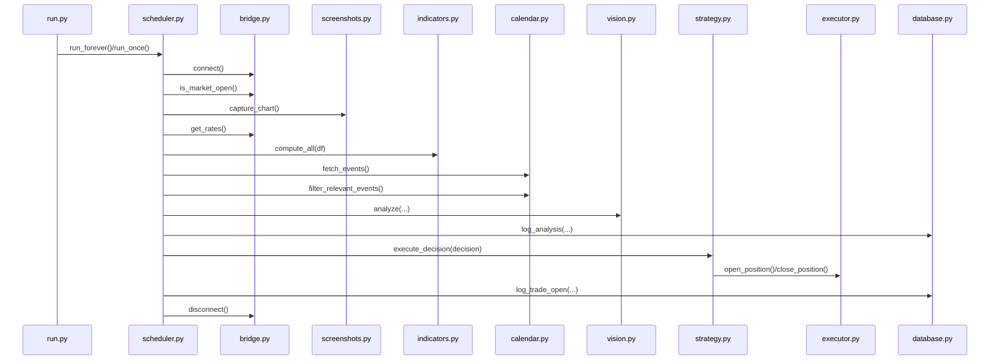

# API et interfaces

> Ce bot ne dispose pas d'API REST ou GraphQL. Il s'agit d'un programme autonome en boucle. Ce document decrit les **interfaces internes** entre les modules.

## Interface : MT5 Bridge

### Connexion / Deconnexion

```python
def connect() -> bool
def disconnect() -> None
```

### Donnees

```python
def get_rates(symbol: str | None = None, timeframe: str | None = None, count: int = 200) -> pd.DataFrame
def get_current_price(symbol: str | None = None) -> float | None
def get_symbol_info(symbol: str | None = None) -> dict | None
def get_account_info() -> dict | None
def is_market_open() -> bool
def get_open_positions(symbol: str | None = None) -> list[dict]
def count_open_positions(symbol: str | None = None) -> int
```

**Symboles par defaut** : `settings.trading_symbol` et `settings.trading_timeframe`.

### Execution

```python
def open_position(direction, volume, stop_loss, take_profit, symbol=None, comment="TradingBot IA") -> TradeResult
def close_position(ticket, symbol=None) -> TradeResult
def calculate_position_size(account_balance, stop_loss_pips, symbol_info, risk_pct=None) -> float
```

### Indicateurs

```python
def compute_all(df: pd.DataFrame) -> dict
```

### Screenshots

```python
def capture_chart(symbol=None) -> Path | None
def cleanup_old_screenshots(max_age_hours=24) -> int
```

---

## Interface : IA

### Vision

```python
def analyze(screenshot_path, symbol, timeframe, indicators, calendar_events, open_positions, account_info) -> dict | None
```

**Format retour** (succes) :

```json
{
    "action": "BUY | SELL | HOLD | CLOSE",
    "confidence": 0-100,
    "reasoning": "string",
    "stop_loss_pips": 0-999,
    "take_profit_pips": 0-999,
    "risk_level": "LOW | MEDIUM | HIGH"
}
```

**Format retour** (echec) : `None`

### Strategie

```python
def execute_decision(decision: dict) -> StrategyResult
```

```python
@dataclass
class StrategyResult:
    decision: dict | None
    trade_result: TradeResult | None
    closed_positions: list[TradeResult]
```

### Prompts

```python
def build_analysis_prompt(symbol, timeframe, indicators, calendar_events, open_positions, account_info) -> str
```

---

## Interface : Data

### Calendrier

```python
def fetch_events(days=1) -> list[dict]
def filter_relevant_events(events, symbol="EURUSD") -> list[dict]
```

### Base de donnees

```python
def get_db() -> sqlite3.Connection
def log_analysis(...) -> int
def log_trade_open(...) -> int
def log_trade_close(ticket, close_price, profit) -> None
def get_recent_trades(limit=20) -> list[dict]
def get_statistics() -> dict
```

### Modeles

```python
@dataclass
class Trade:
    ticket: int
    symbol: str
    direction: str
    volume: float
    opened_at: datetime
    open_price: float
    stop_loss: float
    take_profit: float
    confidence: int
    reasoning: str
    closed_at: Optional[datetime]
    close_price: Optional[float]
    profit: Optional[float]
    id: Optional[int]

@dataclass
class AnalysisLog:
    timestamp: datetime
    symbol: str
    timeframe: str
    decision_action: str
    decision_confidence: int
    decision_reasoning: str
    screenshot_path: str
    indicators_snapshot: str
    calendar_snapshot: str
    was_executed: bool
    id: Optional[int]
```

---

## Interface : Scheduler

```python
def run_once() -> None    # Cycle unique
def run_forever() -> None  # Boucle infinie
```

---

## Schema des appels entre modules


