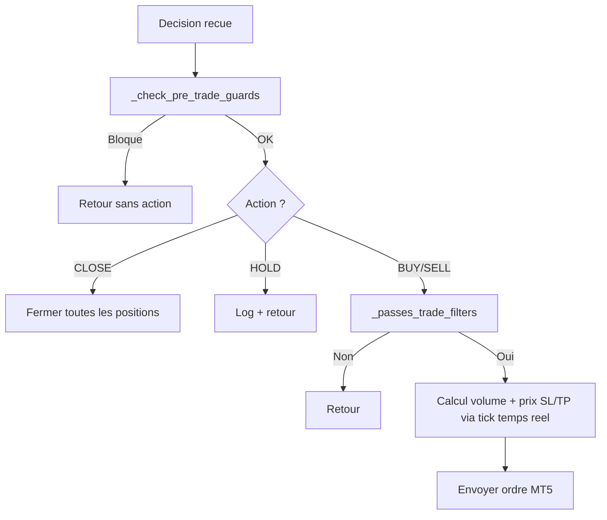

# Module IA : vision.py, strategy.py, prompts.py

## Vue d'ensemble

Le module `src/ai/` est le cerveau du bot. Il contient l'interface avec GPT-4o-mini, la logique de decision et les templates de prompts.

```
src/ai/
  __init__.py
  vision.py       # Analyse GPT-4o-mini Vision
  strategy.py     # Moteur de strategie + risk management
  prompts.py      # Construction du prompt
```

## `vision.py` - Analyse GPT-4o-mini Vision

**Fichier** : `src/ai/vision.py`

### `analyze(screenshot_path, symbol, timeframe, indicators, calendar_events, open_positions, account_info) -> dict | None`

Fonction principale qui envoie le screenshot et les donnees a GPT-4o-mini et retourne la decision.

**Algorithme** :

1. **Ouverture et compression** de l'image via Pillow (redimension 512x384, JPEG 80%)
2. **Encodage base64** du JPEG compresse
3. **Construction du prompt** via `build_analysis_prompt()`
4. **Appel API** OpenAI (modele `gpt-4o-mini`, `detail: low`)
5. **Parsing JSON** avec regex (`re.search(r"\{.*\}", raw, re.DOTALL)`)
6. **Validation** des 6 champs requis
7. **Validation plages** (v1.1): confidence 0-100, SL 5-100 pips, TP >= 1.5x SL, risk_level dans LOW/MEDIUM/HIGH
8. **Retour** du dictionnaire de decision ou `None`

**Decorateur tenacity** :

```python
@retry(stop=stop_after_attempt(3), wait=wait_exponential(multiplier=1, min=2, max=15))
def analyze(...):
```

- 3 tentatives maximum
- Backoff exponentiel : 2s, 4s, 8s entre les tentatives
- Retry sur toute exception (timeout, connexion, rate limit)

**Validation stricte** (v1.1) :

```python
required = ["action", "confidence", "reasoning", "stop_loss_pips", "take_profit_pips", "risk_level"]
valid_actions = {"BUY", "SELL", "HOLD", "CLOSE"}
if not (0 <= decision["confidence"] <= 100):      # rejete
if not (5 <= decision["stop_loss_pips"] <= 100):   # rejete
if decision["take_profit_pips"] < decision["stop_loss_pips"] * 1.5:  # rejete
if decision["risk_level"] not in ("LOW", "MEDIUM", "HIGH"):           # rejete
```

- 6 champs requis + 4 validations de plage
- Rejette les valeurs aberrantes du LLM avant toute execution financiere

---

## `strategy.py` - Moteur de strategie

**Fichier** : `src/ai/strategy.py`

### `StrategyResult` (dataclass)

```python
@dataclass
class StrategyResult:
    decision: dict | None            # Decision IA originale
    trade_result: TradeResult | None  # Resultat du trade (si ouvert)
    closed_positions: list           # Positions fermees (si CLOSE)
```

### `execute_decision(decision) -> StrategyResult`

Applique les regles de gestion des risques et execute la decision.

**Pipeline** (v1.1 - refactore avec gardes pre-trade) :



### Nouvelles fonctions de securite (v1.1)

| Fonction | Role | Declencheur |
|---|---|---|
| `_check_pre_trade_guards()` | Verifie marche, compte, symbole, limite perte jour (flottant inclus) | Avant toute action |
| `_passes_trade_filters()` | Verifie confiance, max positions, spread <= 30, circuit breaker | Avant BUY/SELL |
| `_count_consecutive_losses()` | Compte les pertes consecutives depuis la DB | Circuit breaker |
| `_set_circuit_breaker_until()` | Persiste le blocage 4h dans `bot_state` | Apres 4 pertes |
| `_circuit_breaker_active()` | Verifie si le blocage est en cours | Avant chaque trade |

### `_get_daily_pnl() -> float`

Calcule le P&L du jour : trades fermes + floating P&L des positions ouvertes (v1.1).

```python
today = datetime.now().strftime("%Y-%m-%d")
rows = db.execute(
    "SELECT COALESCE(SUM(profit), 0) FROM trades WHERE DATE(opened_at) = ? AND profit IS NOT NULL",
    [today]
).fetchall()
```

---

## `prompts.py` - Templates de prompts

**Fichier** : `src/ai/prompts.py`

### `build_analysis_prompt(symbol, timeframe, indicators, calendar_events, open_positions, account_info) -> str`

Construit le prompt complet envoye a GPT-4o-mini.

**Structure du prompt** :

1. **Role** : "Tu es un analyste de trading forex expert."
2. **Contexte** : paire, timeframe, prix actuel
3. **Indicateurs** : formates par `_format_indicators()`
4. **Calendrier** : formates par `_format_calendar()`
5. **Positions** : formates par `_format_positions()`
6. **Instructions** : analyser le graphique + donnees
7. **Format de sortie** : JSON strict avec validation explicite

**Extrait du format JSON demande** :

```
{
  "action": "BUY" | "SELL" | "HOLD" | "CLOSE",
  "confidence": 0-100,
  "reasoning": "Analyse courte (max 150 mots)",
  "stop_loss_pips": nombre entier,
  "take_profit_pips": nombre entier,
  "risk_level": "LOW" | "MEDIUM" | "HIGH"
}
```

**Instructions incluses dans le prompt** :
- "CLOSE" uniquement si une position est ouverte
- confidence >= 70 pour executer BUY/SELL
- stop_loss_pips entre 15 et 50 selon la volatilite
- take_profit_pips >= stop_loss_pips * 1.5

### Fonctions de formatage

| Fonction | Donnees en entree | Format de sortie |
|---|---|---|
| `_format_indicators(ind)` | `dict` indicateurs | Texte liste avec valeurs |
| `_format_calendar(events)` | `list[dict]` evenements | Texte liste avec impact, devise, horaire |
| `_format_positions(positions, account)` | `list[dict]` positions | Texte liste avec ticket, direction, P&L |
