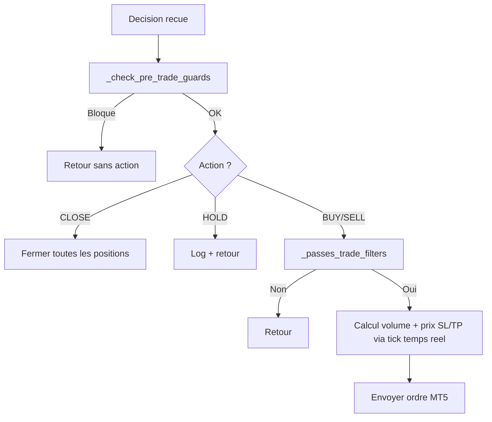

# Module IA v2.1 : ocr.py, analyzer.py, strategy.py, prompts.py

## Vue d'ensemble

Le module `src/ai/` est le cerveau du bot. Architecture en deux etages :
- **OCR** (GPT-4o-mini Vision) : extraction visuelle du chart
- **Analyzer** (DeepSeek V4 Pro) : decision finale avec tout le contexte

```
src/ai/
  __init__.py
  ocr.py         # v2.0 - GPT-4o-mini: extraction visuelle uniquement
  analyzer.py    # v2.0 - DeepSeek V4 Pro: decision avec memoire 1M
  prompts.py     # v2.0 - Prompts OCR + Decision + Memoire + Performance
  strategy.py    # v2.0 - Risk management + position management
  vision.py      # Legacy - fallback GPT-4o-mini (deprecie)
```

---

## `ocr.py` - GPT-4o-mini Vision (extraction visuelle)

**Fichier** : `src/ai/ocr.py`

### `extract_chart_structure(screenshot_path, symbol, timeframe) -> dict | None`

Analyse le chart genere (mplfinance) et extrait UNIQUEMENT les elements visuels. **Ne prend PAS de decision.**

**Entree** :
- Chart PNG genere par `chart_renderer.py` (Ichimoku, EMA, Bollinger, Pivots)

**Sortie JSON** :
```json
{
  "support_levels": [1.0830, 1.0800],
  "resistance_levels": [1.0870, 1.0900],
  "trendlines": "ligne haussiere depuis 1.0820",
  "chart_patterns": ["triangle ascendant"],
  "candlestick_visual": "doji sur resistance",
  "market_phase": "trending_up",
  "price_action_notes": "rejet de 1.0870 avec meche"
}
```

**Non-bloquant** : si l'OCR echoue, le bot continue sans (DeepSeek travaille sur les donnees structurees).

---

## `analyzer.py` - DeepSeek V4 Pro (decision)

**Fichier** : `src/ai/analyzer.py`

### `make_decision(...) -> dict | None`

Envoie TOUTES les donnees a DeepSeek V4 Pro (contexte 1M tokens) pour la decision finale.

**Entrees** :
| Donnee | Source |
|---|---|
| Indicateurs (14+) | `indicators.compute_all()` - RSI, MACD, ADX, Ichimoku, Pivots, etc. |
| OCR chart | `ocr.extract_chart_structure()` |
| Calendrier | `calendar.fetch_events()` |
| Positions + Compte | MT5 live |
| Historique 20 trades | `database.get_recent_trades()` |
| Stats performance | `database.get_statistics()` - win rate, profit total |
| Session contexte | Asian/London/NY, jour de semaine |

**Sortie** : JSON valide avec action, confidence, SL, TP, risk_level.

**Modeles disponibles** :
- `deepseek-v4-pro` : analyse approfondie avec reasoning (~60s)
- `deepseek-v4-flash` : version rapide pour confirmation (~15s)

### `make_decision_fast(...) -> dict | None`

Version avec `deepseek-v4-flash`, utilisee pour les cycles de confirmation.

### `_validate_decision(decision) -> bool`

Validation stricte : champs requis, plages (confidence 0-100, SL 5-100 pour BUY/SELL, TP >= 1.5x SL, risk_level valide). HOLD/CLOSE acceptent SL=0.

---

## `strategy.py` - Risk Management + Position Management

**Fichier** : `src/ai/strategy.py`

### Gestion active des positions (v3.0)

| Fonction | Declencheur | Action |
|---|---|---|
| `_apply_breakeven()` | Profit >= 1.2R (120% du SL initial) | Deplace SL au prix d'entree |
| `_apply_trailing_stop()` | Profit >= 2x SL initial | Trailing stop 15 pips |
| `_check_time_exit()` | Structure de marche inversee (SMA20 + HH/HL) | Ferme la position |
| `manage_open_positions()` | Chaque debut de cycle | Applique les 3 regles ci-dessus |

### `_apply_breaken(pos) -> bool` (v3.0)

Deplace le SL au prix d'entree quand le profit atteint **1.2R** (120% de la distance SL initiale).

**Pourquoi 1.2R au lieu de 0.5R** :
- Le seuil precedent (0.5R) etait trop agressif pour le Forex et XAUUSD
- Le bruit normal du marche declenchait le breakeven avant que le trade ait eu le temps de se developper
- 1.2R couvre les commissions et swaps accumules, tout en laissant une marge de respiration
- Evite l'epidemie de "zero-win" ou les trades gagnants sont systematiquement coupes au breakeven

**Implementation** :
```python
# BUY: profit en pips depuis l'entree >= 1.2 * distance SL en pips
if profit_distance_pips >= sl_distance_pips * 1.2 and current_sl < entry_price:
    _modify_sl(ticket, entry_price)
```

### `_check_time_exit(pos) -> bool` (v3.0 - restructure)

Ferme la position si la **structure de marche s'inverse** contre le trade. Remplace l'ancien timer arbitraire de 120 minutes par une logique basee sur le prix et la structure.

**Logique de sortie par type de position** :

| Position | Condition 1 (SMA20) | Condition 2 (Structure) | Securite |
|---|---|---|---|
| BUY | Prix current < SMA20 | Swing low recent < swing low precedent (HL cassee) | Age > 4h ET P&L < 0.50 |
| SELL | Prix current > SMA20 | Swing high recent > swing high precedent (LH cassee) | Age > 4h ET P&L < 0.50 |

**Implementation** :
```python
def _check_time_exit(pos: dict) -> bool:
    # 1. Recuperer les 20 dernieres bougies M15
    rates = mt5.copy_rates_from_pos(sym, mt5.TIMEFRAME_M15, 0, 20)
    sma20 = sum(close_prices) / 20

    # 2. Pour BUY: verifier SMA20 + structure Higher Low
    if pos_type == BUY:
        if current_price < sma20:           # Tendance haussiere cassee
            return True
        if recent_low < prior_low:           # Structure HL cassee
            return True

    # 3. Pour SELL: verifier SMA20 + structure Lower High
    if pos_type == SELL:
        if current_price > sma20:           # Tendance baissiere cassee
            return True
        if recent_high > prior_high:         # Structure LH cassee
            return True

    # 4. Securite absolue: stagnation >4h sans P&L
    if age_minutes > 240 and abs(pnl) < 0.5:
        return True
```

**Fallback** : si les donnees de rates MT5 sont indisponibles, le systeme revient au chronometre 4h comme unique condition de sortie.

### `_modify_sl(ticket, new_sl) -> None` (v3.0 - stops level broker)

Modifie le stop loss d'une position ouverte avec verification prealable de la distance minimale imposee par le broker (`trade_stops_level`).

**Pourquoi cette verification** :
- MT5 rejette silencieusement les modifications SL/TP si le nouveau niveau est trop proche du prix courant
- Sans cette verification, le bot croyait avoir modifie le SL alors que MT5 l'avait ignore
- `trade_stops_level` est specifique a chaque broker et symbole (ex: 15 points pour EURUSD chez la plupart des brokers)

**Implementation** :
```python
def _modify_sl(ticket: int, new_sl: float) -> None:
    stops_level = sym_info.trade_stops_level * sym_info.point
    if pos_type == BUY:
        distance_from_bid = tick.bid - new_sl
        if distance_from_bid < stops_level and new_sl < tick.bid:
            logger.warning("SL rejete: distance < stops_level broker")
            return  # Skip la modification
    # ... envoi ordre MT5 SLTP seulement si la distance est valide
```

### `_passes_trade_filters(decision, symbol_info) -> bool` (v3.0 - ADX-conditionne)

Les filtres RSI/Bollinger Band anti-tendance sont desormais conditionnes au regime de marche mesure par l'ADX :

| Regime | ADX | Filtres RSI/BB | Logique |
|---|---|---|---|
| Ranging | ADX <= 25 | **Appliques** | Mean-reversion valide: RSI > 75 bloque BUY, RSI < 25 bloque SELL |
| Trending | ADX > 25 | **Desactives** | Trend-following: le RSI peut rester surachete/survendu des heures |

**Avant v3.0** : RSI > 75 ou BB_position > 100% bloquaient systematiquement toutes les entrees, faisant manquer les moves explosifs.

**Apres v3.0** : en tendance forte, le prix surfe sur les bandes de Bollinger et le RSI reste dans les extremes sans corriger. Le bot suit la tendance au lieu de la combattre.

### Gardes pre-trade

| Filtre | Seuil |
|---|---|
| Marche ouvert | `trade_mode == FULL` |
| Perte jour (flottante incluse) | < 3% du capital |
| Confiance IA | >= 70% |
| Max positions | 1 |
| Spread | <= 30 points |
| Circuit breaker | 4 pertes consecutives → pause 4h |
if not (5 <= decision["stop_loss_pips"] <= 100):   # rejete
if decision["take_profit_pips"] < decision["stop_loss_pips"] * 1.5:  # rejete
if decision["risk_level"] not in ("LOW", "MEDIUM", "HIGH"):           # rejete
```

- 6 champs requis + 4 validations de plage
- Rejette les valeurs aberrantes du LLM avant toute execution financiere

---

## `strategy.py` - Moteur de strategie

**Fichier** : `src/ai/strategy.py`

### `StrategyResult` (dataclass)

```python
@dataclass
class StrategyResult:
    decision: dict | None            # Decision IA originale
    trade_result: TradeResult | None  # Resultat du trade (si ouvert)
    closed_positions: list           # Positions fermees (si CLOSE)
```

### `execute_decision(decision) -> StrategyResult`

Applique les regles de gestion des risques et execute la decision.

**Pipeline** (v1.1 - refactore avec gardes pre-trade) :



### Nouvelles fonctions de securite (v1.1)

| Fonction | Role | Declencheur |
|---|---|---|
| `_check_pre_trade_guards()` | Verifie marche, compte, symbole, limite perte jour (flottant inclus) | Avant toute action |
| `_passes_trade_filters()` | Verifie confiance, max positions, spread <= 30, circuit breaker | Avant BUY/SELL |
| `_count_consecutive_losses()` | Compte les pertes consecutives depuis la DB | Circuit breaker |
| `_set_circuit_breaker_until()` | Persiste le blocage 4h dans `bot_state` | Apres 4 pertes |
| `_circuit_breaker_active()` | Verifie si le blocage est en cours | Avant chaque trade |

### `_get_daily_pnl() -> float`

Calcule le P&L du jour : trades fermes + floating P&L des positions ouvertes (v1.1).

```python
today = datetime.now().strftime("%Y-%m-%d")
rows = db.execute(
    "SELECT COALESCE(SUM(profit), 0) FROM trades WHERE DATE(opened_at) = ? AND profit IS NOT NULL",
    [today]
).fetchall()
```

---

## `prompts.py` - Templates de prompts

**Fichier** : `src/ai/prompts.py`

### `build_analysis_prompt(symbol, timeframe, indicators, calendar_events, open_positions, account_info) -> str`

Construit le prompt complet envoye a GPT-4o-mini.

**Structure du prompt** :

1. **Role** : "Tu es un analyste de trading forex expert."
2. **Contexte** : paire, timeframe, prix actuel
3. **Indicateurs** : formates par `_format_indicators_v2()` (etats semantiques v3.0)
4. **Calendrier** : formates par `_format_calendar()`
5. **Positions** : formates par `_format_positions()`
6. **Instructions** : analyser le graphique + donnees
7. **Format de sortie** : JSON strict avec validation explicite

**Extrait du format JSON demande** :

```
{
  "action": "BUY" | "SELL" | "HOLD" | "CLOSE",
  "confidence": 0-100,
  "reasoning": "Analyse courte (max 150 mots)",
  "stop_loss_pips": nombre entier,
  "take_profit_pips": nombre entier,
  "risk_level": "LOW" | "MEDIUM" | "HIGH"
}
```

**Instructions incluses dans le prompt** :
- "CLOSE" uniquement si une position est ouverte
- confidence >= 70 pour executer BUY/SELL
- stop_loss_pips entre 15 et 50 selon la volatilite
- take_profit_pips >= stop_loss_pips * 1.5

### Fonctions de formatage

| Fonction | Donnees en entree | Format de sortie |
|---|---|---|
| `_format_indicators(ind)` | `dict` indicateurs | Texte liste avec valeurs (legacy) |
| `_format_indicators_v2(ind)` | `dict` indicateurs | Texte avec etats semantiques (v3.0) |
| `_format_calendar(events)` | `list[dict]` evenements | Texte liste avec impact, devise, horaire |
| `_format_positions(positions, account)` | `list[dict]` positions | Texte liste avec ticket, direction, P&L |

### `_format_indicators_v2(ind) -> str` (v3.0 - semantique)

Convertit les valeurs brutes d'indicateurs en **etats semantiques** pour le LLM. Les LLMs sont des moteurs de logique semantique, pas des calculateurs mathematiques - leur fournir des etats interpretes donne de meilleurs resultats que des nombres bruts.

| Indicateur | Valeur brute | Etat semantique envoye au LLM |
|---|---|---|
| RSI 14 | `rsi_14` float | `"RSI 14: 78.2 - Zone de SURACHAT (pression acheteuse extreme)"` |
| RSI 14 | `rsi_14` float | `"RSI 14: 65.0 - Tendance haussiere (momentum positif)"` |
| MACD | `macd_line`, `macd_signal` | `"MACD au-dessus du Signal (momentum haussier) en zone negative"` |
| Bollinger | `bb_position_pct` | `"Prix SUR LA BANDE SUPERIEURE (surf haussier, possible cassure)"` |
| ATR | `atr_14`, `current_price` | `"ATR 14: 0.00152 - VOLATILITE ELEVEE (0.52% du prix)"` |
| Range 24h | `high_24h`, `low_24h` | `"Range 24h: ... (prix a 72.3% du bas, 27.7% du haut)"` |

**Seuils de classification** :

- **RSI** : SURACHAT (>75), Tendance haussiere (60-75), Zone neutre (40-60), Tendance baissiere (25-40), SURVENTE (<25)
- **Bollinger** : SUR LA BANDE SUPERIEURE (>95%), MOITIE SUPERIEURE (70-95%), ZONE MEDIANE (30-70%), MOITIE INFERIEURE (5-30%), SUR LA BANDE INFERIEURE (<5%)
- **ATR** : VOLATILITE ELEVEE (>0.5% du prix), Volatilite moderee (0.2-0.5%), Volatilite faible (<0.2%)
- **Moving Averages** : Prix \"au-dessus\" ou \"sous\" chaque moyenne (SMA20, SMA50, EMA200)
- **MACD** : Croisement (au-dessus/sous Signal), zone (positive/negative), histogramme (acceleration haussiere/baissiere)

**Pourquoi des etats semantiques** :
- Un LLM ne calcule pas, il raisonne par association de concepts
- Dire \"RSI en zone de surachat avec pression acheteuse extreme\" est plus informatif que `RSI=78.2`
- Le LLM peut correler \"SURACHAT\" avec \"BANDE SUPERIEURE\" et \"MOMENTUM HAUSSIER\" pour inferer une continuation de tendance
- Les positions relatives (\"au-dessus de la SMA20\") sont plus parlantes que les valeurs absolues
