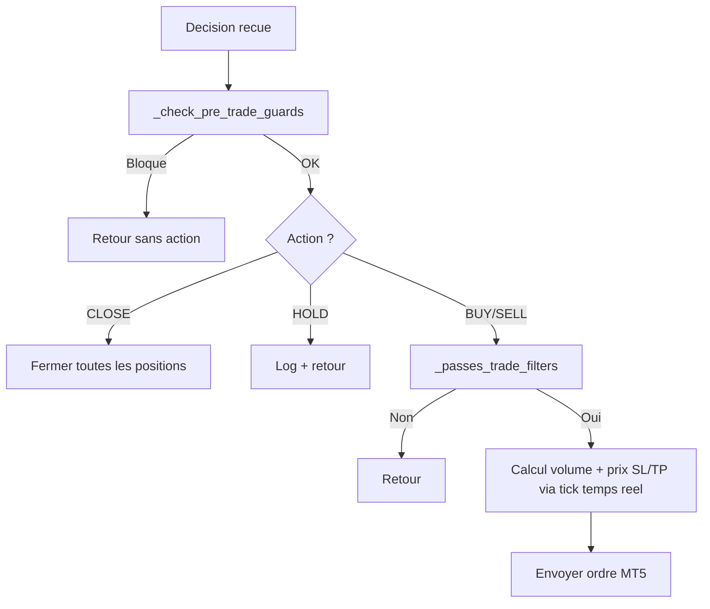

# Module IA v2.1 : ocr.py, analyzer.py, strategy.py, prompts.py

## Vue d'ensemble

Le module `src/ai/` est le cerveau du bot. Architecture en deux etages :
- **OCR** (GPT-4o-mini Vision) : extraction visuelle du chart
- **Analyzer** (DeepSeek V4 Pro) : decision finale avec tout le contexte

```
src/ai/
  __init__.py
  ocr.py         # v2.0 - GPT-4o-mini: extraction visuelle uniquement
  analyzer.py    # v2.0 - DeepSeek V4 Pro: decision avec memoire 1M
  prompts.py     # v2.0 - Prompts OCR + Decision + Memoire + Performance
  strategy.py    # v2.0 - Risk management + position management
  vision.py      # Legacy - fallback GPT-4o-mini (deprecie)
```

---

## `ocr.py` - GPT-4o-mini Vision (extraction visuelle)

**Fichier** : `src/ai/ocr.py`

### `extract_chart_structure(screenshot_path, symbol, timeframe) -> dict | None`

Analyse le chart genere (mplfinance) et extrait UNIQUEMENT les elements visuels. **Ne prend PAS de decision.**

**Entree** :
- Chart PNG genere par `chart_renderer.py` (Ichimoku, EMA, Bollinger, Pivots)

**Sortie JSON** :
```json
{
  "support_levels": [1.0830, 1.0800],
  "resistance_levels": [1.0870, 1.0900],
  "trendlines": "ligne haussiere depuis 1.0820",
  "chart_patterns": ["triangle ascendant"],
  "candlestick_visual": "doji sur resistance",
  "market_phase": "trending_up",
  "price_action_notes": "rejet de 1.0870 avec meche"
}
```

**Non-bloquant** : si l'OCR echoue, le bot continue sans (DeepSeek travaille sur les donnees structurees).

---

## `analyzer.py` - DeepSeek V4 Pro (decision)

**Fichier** : `src/ai/analyzer.py`

### `make_decision(...) -> dict | None`

Envoie TOUTES les donnees a DeepSeek V4 Pro (contexte 1M tokens) pour la decision finale.

**Entrees** :
| Donnee | Source |
|---|---|
| Indicateurs (14+) | `indicators.compute_all()` - RSI, MACD, ADX, Ichimoku, Pivots, etc. |
| OCR chart | `ocr.extract_chart_structure()` |
| Calendrier | `calendar.fetch_events()` |
| Positions + Compte | MT5 live |
| Historique 20 trades | `database.get_recent_trades()` |
| Stats performance | `database.get_statistics()` - win rate, profit total |
| Session contexte | Asian/London/NY, jour de semaine |

**Sortie** : JSON valide avec action, confidence, SL, TP, risk_level.

**Modeles disponibles** :
- `deepseek-v4-pro` : analyse approfondie avec reasoning (~60s)
- `deepseek-v4-flash` : version rapide pour confirmation (~15s)

### `make_decision_fast(...) -> dict | None`

Version avec `deepseek-v4-flash`, utilisee pour les cycles de confirmation.

### `_validate_decision(decision) -> bool`

Validation stricte : champs requis, plages (confidence 0-100, SL 5-100 pour BUY/SELL, TP >= 1.5x SL, risk_level valide). HOLD/CLOSE acceptent SL=0.

---

## `strategy.py` - Risk Management + Position Management

**Fichier** : `src/ai/strategy.py`

### Gestion active des positions (v2.0)

| Fonction | Declencheur | Action |
|---|---|---|
| `_apply_breakeven()` | Profit >= 1x SL initial | Deplace SL au prix d'entree |
| `_apply_trailing_stop()` | Profit >= 2x SL initial | Trailing stop 15 pips |
| `_check_time_exit()` | > 45 min sans progression | Ferme la position stagnante |
| `manage_open_positions()` | Chaque debut de cycle | Applique les 3 regles ci-dessus |

### Gardes pre-trade

| Filtre | Seuil |
|---|---|
| Marche ouvert | `trade_mode == FULL` |
| Perte jour (flottante incluse) | < 3% du capital |
| Confiance IA | >= 70% |
| Max positions | 1 |
| Spread | <= 30 points |
| Circuit breaker | 4 pertes consecutives → pause 4h |
if not (5 <= decision["stop_loss_pips"] <= 100):   # rejete
if decision["take_profit_pips"] < decision["stop_loss_pips"] * 1.5:  # rejete
if decision["risk_level"] not in ("LOW", "MEDIUM", "HIGH"):           # rejete
```

- 6 champs requis + 4 validations de plage
- Rejette les valeurs aberrantes du LLM avant toute execution financiere

---

## `strategy.py` - Moteur de strategie

**Fichier** : `src/ai/strategy.py`

### `StrategyResult` (dataclass)

```python
@dataclass
class StrategyResult:
    decision: dict | None            # Decision IA originale
    trade_result: TradeResult | None  # Resultat du trade (si ouvert)
    closed_positions: list           # Positions fermees (si CLOSE)
```

### `execute_decision(decision) -> StrategyResult`

Applique les regles de gestion des risques et execute la decision.

**Pipeline** (v1.1 - refactore avec gardes pre-trade) :



### Nouvelles fonctions de securite (v1.1)

| Fonction | Role | Declencheur |
|---|---|---|
| `_check_pre_trade_guards()` | Verifie marche, compte, symbole, limite perte jour (flottant inclus) | Avant toute action |
| `_passes_trade_filters()` | Verifie confiance, max positions, spread <= 30, circuit breaker | Avant BUY/SELL |
| `_count_consecutive_losses()` | Compte les pertes consecutives depuis la DB | Circuit breaker |
| `_set_circuit_breaker_until()` | Persiste le blocage 4h dans `bot_state` | Apres 4 pertes |
| `_circuit_breaker_active()` | Verifie si le blocage est en cours | Avant chaque trade |

### `_get_daily_pnl() -> float`

Calcule le P&L du jour : trades fermes + floating P&L des positions ouvertes (v1.1).

```python
today = datetime.now().strftime("%Y-%m-%d")
rows = db.execute(
    "SELECT COALESCE(SUM(profit), 0) FROM trades WHERE DATE(opened_at) = ? AND profit IS NOT NULL",
    [today]
).fetchall()
```

---

## `prompts.py` - Templates de prompts

**Fichier** : `src/ai/prompts.py`

### `build_analysis_prompt(symbol, timeframe, indicators, calendar_events, open_positions, account_info) -> str`

Construit le prompt complet envoye a GPT-4o-mini.

**Structure du prompt** :

1. **Role** : "Tu es un analyste de trading forex expert."
2. **Contexte** : paire, timeframe, prix actuel
3. **Indicateurs** : formates par `_format_indicators()`
4. **Calendrier** : formates par `_format_calendar()`
5. **Positions** : formates par `_format_positions()`
6. **Instructions** : analyser le graphique + donnees
7. **Format de sortie** : JSON strict avec validation explicite

**Extrait du format JSON demande** :

```
{
  "action": "BUY" | "SELL" | "HOLD" | "CLOSE",
  "confidence": 0-100,
  "reasoning": "Analyse courte (max 150 mots)",
  "stop_loss_pips": nombre entier,
  "take_profit_pips": nombre entier,
  "risk_level": "LOW" | "MEDIUM" | "HIGH"
}
```

**Instructions incluses dans le prompt** :
- "CLOSE" uniquement si une position est ouverte
- confidence >= 70 pour executer BUY/SELL
- stop_loss_pips entre 15 et 50 selon la volatilite
- take_profit_pips >= stop_loss_pips * 1.5

### Fonctions de formatage

| Fonction | Donnees en entree | Format de sortie |
|---|---|---|
| `_format_indicators(ind)` | `dict` indicateurs | Texte liste avec valeurs |
| `_format_calendar(events)` | `list[dict]` evenements | Texte liste avec impact, devise, horaire |
| `_format_positions(positions, account)` | `list[dict]` positions | Texte liste avec ticket, direction, P&L |
