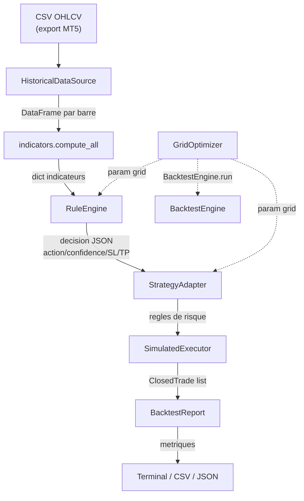

# Module Backtest : backtesteur hybride deterministe

## Vue d'ensemble

Le module `src/backtest/` fournit un backtesteur complet qui simule l'execution du trading bot sur des donnees historiques sans cout API et sans connexion MT5. Il remplace la couche IA (OCR + DeepSeek) par un **RuleEngine** deterministe a scoring pondere, tout en conservant les memes regles de risk management.

Les 8 composants du module :

```
src/backtest/
  __init__.py
  data_source.py        # Lecture CSV OHLCV, remplace MT5 bridge
  rules_engine.py       # Scoring pondere 20 signaux, remplace AI (OCR+DeepSeek)
  simulated_executor.py # Positions virtuelles, SL/TP, slippage, commission
  strategy_adapter.py   # Regles de risque repliquees sans MT5
  engine.py             # Boucle barre-par-barre principale
  report.py             # Metriques : Sharpe, Sortino, drawdown, win rate, etc.
  optimizer.py          # Grid search sur les parametres
  weights.yaml          # Configuration des poids par defaut
```

---

## Architecture et flux de donnees



### Etapes du flux

1. **Chargement** : `HistoricalDataSource` lit un fichier CSV (exporte depuis MT5 via `mt5.copy_rates_range`) contenant les colonnes `datetime, open, high, low, close, tick_volume, spread`.
2. **Indicateurs** : a chaque barre, `indicators.compute_all()` calcule le meme dictionnaire d'indicateurs qu'en production (RSI, MACD, ADX, Ichimoku, Bollinger, Pivots, patterns, structure).
3. **Scoring** : le `RuleEngine` evalue 20 signaux ponderes et produit une decision JSON identique au format de sortie de DeepSeek (`action`, `confidence`, `stop_loss_pips`, `take_profit_pips`, `risk_level`).
4. **Risk management** : le `StrategyAdapter` applique les memes regles qu'en production (pertes quotidiennes max, circuit breaker, position sizing, spread filter).
5. **Execution simulee** : le `SimulatedExecutor` gere les positions virtuelles (ouverture, SL/TP, slippage, commission).
6. **Rapport** : le `BacktestReport` calcule les metriques de performance (Sharpe, Sortino, profit factor, drawdown, win rate).

---

## Export des donnees MT5 pour backtesting

Le backtesteur lit des fichiers CSV structures comme suit :

```
data/historical/
  eurusd/
    eurusd_M15_2024-01.csv
    eurusd_M15_2024-02.csv
  gbpusd/
    gbpusd_M15_2024-01.csv
  ...
```

### Methode 1 : Export via MT5 Python API

```python
import MetaTrader5 as mt5
import pandas as pd
from datetime import datetime

mt5.initialize()

rates = mt5.copy_rates_range(
    "EURUSD",
    mt5.TIMEFRAME_M15,
    datetime(2024, 1, 1),
    datetime(2024, 1, 31),
)

df = pd.DataFrame(rates)
df["datetime"] = pd.to_datetime(df["time"], unit="s")
df = df[["datetime", "open", "high", "low", "close", "tick_volume", "spread"]]
df.to_csv("data/historical/eurusd/eurusd_M15_2024-01.csv", index=False)

mt5.shutdown()
```

### Methode 2 : Export via l'interface MT5

1. Ouvrir MT5 et le graphique du symbole.
2. Appuyer sur **F2** pour ouvrir l'Historique du Centre.
3. Selectionner la periode.
4. Clic droit > **Exporter** > choisir CSV.
5. Renommer et placer dans `data/historical/{symbol}/`.

### CLI d'export integree

```bash
python backtest.py --export --symbol EURUSD
python backtest.py --export --symbol EURUSD --timeframe H1 --months 6
```

---

## Table de scoring du RuleEngine (20 signaux)

Le `RuleEngine` evalue chaque signal et additionne les poids. Poids positifs = haussier, negatifs = baissier.

| # | Categorie | Signal | Condition | Poids BUY | Poids SELL |
|---|---|---|---|---|---|
| 1 | Tendance | Prix > SMA20 | `trend_short == "haussier"` | +10 | +10 |
| 2 | Tendance | Prix > SMA50 | `trend_medium == "haussier"` | +5 | +5 |
| 3 | Tendance | Prix > Nuage Ichimoku | `ichimoku_trend == "haussier"` | +15 | +15 |
| 4 | Tendance | Prix < Nuage Ichimoku | `ichimoku_trend == "baissier"` | - | +15 |
| 5 | Momentum | RSI survendu | `rsi_14 < 30` | +15 | - |
| 6 | Momentum | RSI surachete | `rsi_14 > 70` | - | +15 |
| 7 | Momentum | MACD > Signal | `macd_line > macd_signal` | +10 | +10 |
| 8 | Momentum | MACD histogram > 0 | `macd_histogram > 0` | +5 | +5 |
| 9 | Force (ADX) | DI+ domine (ADX >= 25) | `di_plus > di_minus` | +10 | - |
| 10 | Force (ADX) | DI- domine (ADX >= 25) | `di_minus > di_plus` | - | +10 |
| 11 | Volatilite | Prix proche bande inf Bollinger | `bb_position_pct < 20` | +10 | - |
| 12 | Volatilite | Prix proche bande sup Bollinger | `bb_position_pct > 80` | - | +10 |
| 13 | Pivots | Prix proche S1/S2 | `distance < 0.3%` | +10 | - |
| 14 | Pivots | Prix proche R1/R2 | `distance < 0.3%` | - | +10 |
| 15 | Patterns | Pattern chandelier haussier | hammer, engulfing, morning star... | +15 | - |
| 16 | Patterns | Pattern chandelier baissier | shooting star, evening star... | - | +15 |
| 17 | Structure | HH/HL (higher highs/lows) | `market_structure == "hh_hl"` | +10 | - |
| 18 | Structure | LH/LL (lower highs/lows) | `market_structure == "lh_ll"` | - | +10 |
| 19 | Confluence H1 | Tendance H1 haussiere | `h1_trend == "haussier"` | +5 | - |
| 20 | Confluence H1 | Tendance H1 baissiere | `h1_trend == "baissier"` | - | +5 |

**Seuils de decision** (configurables) :
- Score net >= `buy_threshold` (defaut: 25) : **BUY**
- Score net <= `-sell_threshold` (defaut: -25) : **SELL**
- Sinon : **HOLD**

**Calcul du SL/TP** :
- `SL (pips) = max(15, min(50, (ATR * sl_atr_mult) / (10 * point)))`
- `TP (pips) = max(SL * 1.5, (ATR * tp_atr_mult) / (10 * point))`

**Niveau de confiance** :
- `confidence = min(95, 50 + net_score // 2)` si signal, sinon base sur le score brut.

**Niveau de risque** :
- ADX >= 30 : LOW
- ADX >= 20 : MEDIUM
- Sinon : HIGH

---

## Configuration via `weights.yaml`

```yaml
# Seuils de decision
buy_threshold: 25
sell_threshold: 25

# Multiplicateurs SL/TP bases sur l'ATR
sl_atr_mult: 1.5
tp_atr_mult: 2.5

# Parametres de strategie (gestion des risques)
max_risk_per_trade_pct: 1.0
max_daily_loss_pct: 3.0
max_open_positions: 1
min_confidence_threshold: 70

weights:
  price_above_sma20: 10
  price_above_sma50: 5
  price_above_cloud: 15
  price_below_cloud: -15
  rsi_oversold: 15
  rsi_overbought: -15
  macd_above_signal: 10
  macd_histogram_rising: 5
  adx_di_plus_strong: 10
  adx_di_minus_strong: -10
  bb_near_lower: 10
  bb_near_upper: -10
  near_support: 10
  near_resistance: -10
  bullish_pattern: 15
  bearish_pattern: -15
  higher_high_higher_low: 10
  lower_high_lower_low: -10
  h1_trend_bullish: 5
  h1_trend_bearish: -5
```

Pour utiliser un fichier de poids personnalise :

```bash
python backtest.py --symbol EURUSD --from 2026-05-01 --to 2026-05-31 --weights my_weights.yaml
```

---

## Utilisation CLI

### Backtest simple (1 symbole)

```bash
python backtest.py --symbol EURUSD --from 2026-05-01 --to 2026-05-31
```

Options :
- `--timeframe M15` (defaut) ou `H1`
- `--balance 10000` : solde initial
- `--data-dir data/historical` : dossier des CSV
- `--weights src/backtest/weights.yaml` : fichier de poids personnalise

### Backtest multi-symboles

```bash
python backtest.py --multi --from 2026-05-01 --to 2026-05-31
```

Execute le backtest sur les 6 symboles simultanement (EURUSD, GBPUSD, AUDUSD, USDJPY, USDCHF, XAUUSD) et affiche un rapport consolide.

### Optimisation par grid search

```bash
python backtest.py --symbol EURUSD --optimize --metric sharpe_ratio
```

Metriques disponibles pour l'optimisation : `sharpe_ratio`, `sortino_ratio`, `profit_factor`, `win_rate`, `net_profit`, `return_pct`, `max_drawdown_pct`.

Le grid search teste par defaut :
- `buy_threshold` : [15, 20, 25, 30, 35]
- `sell_threshold` : [15, 20, 25, 30, 35]
- `sl_atr_mult` : [1.0, 1.5, 2.0]
- `tp_atr_mult` : [2.0, 2.5, 3.0, 3.5]
- `max_risk_per_trade_pct` : [0.5, 1.0, 1.5]

Grille personnalisable via `--optimize-config my_grid.json`.

### Export des trades

```bash
python backtest.py --symbol EURUSD --from 2026-05-01 --to 2026-05-31 --output trades.csv
python backtest.py --multi --from 2026-05-01 --to 2026-05-31 --output all_trades.json
```

### Export des donnees MT5

```bash
python backtest.py --export --symbol EURUSD
python backtest.py --export --symbol XAUUSD --timeframe H1 --months 6
```

---

## Metriques calculees

Le `BacktestReport` produit les metriques suivantes :

| Metrique | Description | Formule |
|---|---|---|
| **Net Profit** | Profit net total | Somme des P&L de tous les trades |
| **Gross Profit / Loss** | Profit brut / Perte brute | Somme des trades gagnants / perdants |
| **Profit Factor** | Ratio profit/perte | Gross Profit / Gross Loss |
| **Win Rate** | Taux de reussite | Trades gagnants / Total trades |
| **Avg Win / Avg Loss** | Gain moyen / Perte moyenne | Moyenne des trades gagnants / perdants |
| **Largest Win / Loss** | Plus grand gain / perte | Max / Min des P&L individuels |
| **Max Drawdown %** | Drawdown maximal | Plus grande baisse pic-creux en % du capital |
| **Max Drawdown Duration** | Duree du drawdown max | Nombre de barres du drawdown le plus long |
| **Sharpe Ratio** | Rendement ajuste au risque | Moyenne(P&L) / Std(P&L) * sqrt(N) |
| **Sortino Ratio** | Sharpe avec deviation baissiere | Moyenne(P&L) / Std(P&L negatifs) * sqrt(N) |
| **Return %** | Rendement total | Net Profit / Solde initial * 100 |
| **Avg Bars Held** | Duree moyenne des trades | Moyenne du nombre de barres par trade |
| **Exit Reasons** | Repartition des sorties | SL / TP / MANUAL / REVERSAL / TIME_EXIT |

Les rapports incluent egalement la courbe d'equity et la courbe de drawdown.

---

## Limitations

Le backtesteur ne modelise pas :

- **Analyse OCR** : les patterns graphiques complexes detectes visuellement par GPT-4o-mini (doubles sommets, triangles, drapeaux) ne sont pas captures par le RuleEngine.
- **News et evenements** : le calendrier economique (ForexFactory) n'est pas simule. Les impacts des news (spikes de volatilite, slippage extreme) sont absents.
- **Hallucinations IA** : le comportement imprevisible de l'IA (parfois benefique, parfois nefaste) n'est pas modelise.
- **Latence et slippage realistes** : le slippage est modelise de facon simplifiee (spread fixe), pas de slippage variable selon la volatilite.
- **Profondeur de marche** : pas de simulation de carnet d'ordres ou de liquidite.

**Regle d'interpretation** : un bon resultat en backtest est une condition necessaire mais pas suffisante pour le deploiement en live. Toujours valider en demo avec l'IA reelle avant de passer en production.
