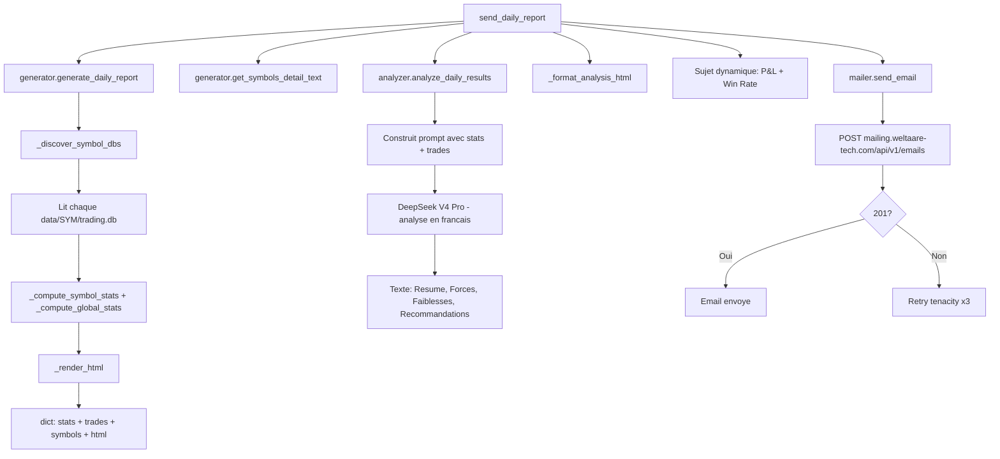

# Module Rapports Journaliers : mailer.py, generator.py, analyzer.py, daily_report.py

**Fichiers** : `src/reports/mailer.py`, `src/reports/generator.py`, `src/reports/analyzer.py`, `src/reports/daily_report.py`

## Vue d'ensemble

Le module `src/reports/` genere et envoie un rapport journalier complet par email. Il consolide les trades de toutes les paires, calcule des statistiques, demande une analyse a DeepSeek V4 Pro, et envoie le tout par email via l'API `mailing.weltaare-tech.com`.



---

## `mailer.py` - Client HTTP pour l'API d'envoi

**Fichier** : `src/reports/mailer.py`

### `send_email(recipient_email, subject, body_html, recipient_name="", sender_name="") -> bool`

Envoie un email via l'API REST `mailing.weltaare-tech.com`.

**Authentification** : Header `X-API-Secret` avec la cle configuree dans `MAILER_API_SECRET`.

**Retry** : 3 tentatives avec backoff exponentiel (2s, 4s, 8s) via `tenacity`.

**Codes de retour** :
| Code | Signification |
|---|---|
| `201` | Email envoye avec succes. Le corps contient l'UUID de l'email. |
| `401` | `X-API-Secret` invalide. Verifier `MAILER_API_SECRET` dans `.env`. |
| `429` | Rate limit atteint. Le retry automatique gere ce cas. |
| Autre | Erreur logguee, retourne `False`. |

**Payload** :
```json
{
    "recipient_email": "dialloabdoul99c@gmail.com",
    "subject": "Rapport Trading 01/06/2026 | 5 trades | P&L: +42.50 $ | WR: 60.0%",
    "body_html": "<html>...</html>",
    "recipient_name": "Abdoul",
    "sender_name": "Trading Bot MT5"
}
```

**Dependances** : `httpx` (HTTP client), `tenacity` (retry).

---

## `generator.py` - Generateur de rapport

**Fichier** : `src/reports/generator.py`

### `generate_daily_report(date=None) -> dict`

Point d'entree principal du generateur. Decouvre toutes les bases de donnees par symbole, calcule les statistiques et produit le HTML.

**Decouverte des bases** : La fonction `_discover_symbol_dbs()` parcourt `data/` et trouve tous les fichiers `SYM/trading.db` (EURUSD, GBPUSD, AUDUSD, USDJPY, USDCHF, XAUUSD).

**Retour** :
```python
{
    "stats": {                     # Statistiques globales
        "total_trades": 8,
        "closed": 6,
        "open": 2,
        "wins": 4,
        "losses": 2,
        "win_rate": 66.7,
        "total_profit": 42.50,
        "best_trade": 25.00,
        "worst_trade": -15.30,
        "avg_profit": 7.08,
        "avg_confidence": 78.5,
        "avg_duration": "12.3 min",
        "symbols_count": 3,
    },
    "trades": [...],               # Liste de tous les trades du jour
    "symbols": {                   # Detail par symbole
        "EURUSD": {
            "stats": {...},        # Memes cles que global
            "trades": [...]
        },
        ...
    },
    "html": "<html>...</html>",    # Rapport HTML complet
    "has_trades": True,
}
```

### `get_symbols_detail_text(symbols_data) -> str`

Genere un texte formate avec les details par symbole, destine au prompt DeepSeek.

```
- EURUSD: 3 trades, 2W/1L (WR: 66.7%), P&L: +15.20 $, moy/trade: +5.07 $
- GBPUSD: 2 trades, 1W/1L (WR: 50.0%), P&L: -8.50 $, moy/trade: -4.25 $
```

### `_compute_symbol_stats(trades) -> dict`

Calcule les statistiques pour un symbole : wins, losses, win rate, P&L total, meilleur/pire trade, profit moyen, duree moyenne, confiance moyenne.

### `_compute_global_stats(all_trades, symbols_data) -> dict`

Calcule les memes statistiques au niveau global (tous symboles confondus).

### `_render_html(date_display, global_stats, symbols_data, all_trades) -> str`

Produit le HTML complet du rapport :

- **Theme** : Dark mode (fond `#020617`, cartes `#0f172a`)
- **En-tete** : Titre + date + mention "Genere automatiquement"
- **Cartes resume** : Total trades, Gagnants (vert), Perdants (rouge), Win Rate, P&L Total
- **Ligne details** : Meilleur trade, Pire trade, Moyen, Duree moyenne, Confiance moyenne
- **Par symbole** : Une carte par paire avec mini-stats + tableau des trades (ouverture, direction, volume, prix, P&L)
- **Placeholder** : `{{ANALYSIS_PLACEHOLDER}}` pour l'analyse DeepSeek (remplace par `daily_report.py`)
- **Pied de page** : Nombre de paires surveillees

---

## `analyzer.py` - Analyse DeepSeek V4 Pro

**Fichier** : `src/reports/analyzer.py`

### `analyze_daily_results(stats, trades, symbols_detail) -> str`

Envoie les statistiques et trades du jour a DeepSeek V4 Pro pour une analyse approfondie.

**Prompt** : Inclut les statistiques globales, le detail par symbole, et la liste des trades (max 50). Demande une analyse en francais structuree en 4 sections :

| Section | Contenu |
|---|---|
| **Resume** | Synthese des performances du jour en 2-3 phrases |
| **Forces** | Ce qui a bien fonctionne (paires, patterns, moments de la journee) |
| **Faiblesses** | Ce qui a mal fonctionne, pertes notables, erreurs potentielles |
| **Recommandations** | Suggestions concretes (parametres, gestion du risque, filtres, horaires) |

**Modele** : `deepseek-v4-pro`, max 2000 tokens, temperature 0.4.

**Retry** : 2 tentatives avec backoff exponentiel (3s, 6s).

**Fallback** : Si `DEEPSEEK_API_KEY` est vide, retourne un message indiquant que l'analyse est indisponible.

---

## `daily_report.py` - Orchestrateur

**Fichier** : `src/reports/daily_report.py`

### `send_daily_report(date=None) -> bool`

Orchestre le pipeline complet :

1. **Generation** - `generate_daily_report(date)` : statistiques + HTML
2. **Analyse** - `analyze_daily_results(stats, trades, symbols_detail)` : texte DeepSeek
3. **Formatage** - `_format_analysis_html(text)` : conversion du texte en HTML (paragraphes, gras, emojis)
4. **Sujet** - Construction dynamique : `Rapport Trading {date} | {N} trades | P&L: +/-XX.XX $ | WR: XX%`
5. **Envoi** - `send_email(...)` vers le destinataire configure

### `_format_analysis_html(text) -> str`

Convertit le texte brut de l'analyse en HTML :
- Lignes vides -> `</p><p>`
- `**texte**` -> `<strong>texte</strong>`
- Lignes commencant par `- ` -> `<li>` (dans une `<ul>`)
- Lignes commencant par `### ` -> `<h3>`
- Echappement HTML (`&`, `<`, `>`)

---

## Integration Scheduler

Dans `src/scheduler/scheduler.py`, la fonction `run_forever()` ajoute un job CronTrigger :

```python
scheduler.add_job(
    send_daily_report,
    CronTrigger(hour=settings.report_send_hour_utc, minute=settings.report_send_minute_utc),
    id="daily_report",
    name="Rapport journalier par email",
    max_instances=1,
    misfire_grace_time=300,
)
```

- **Horaire par defaut** : 23:00 UTC (configurable via `REPORT_SEND_HOUR_UTC` / `REPORT_SEND_MINUTE_UTC`)
- **Misfire grace** : 5 minutes (si le scheduler est occupe, le rapport peut partir avec 5 min de retard)
- **Max instances** : 1 (pas d'envoi concurrent)

---

## Script standalone

**Fichier** : `scripts/send_report.py`

```powershell
# Rapport du jour (date UTC courante)
python scripts/send_report.py

# Rapport d'une date specifique
python scripts/send_report.py 2026-06-01
```

Utile pour tester la configuration mailer ou regenerer un rapport pour une date passee.
