# Rapport d'Audit de Trading Quotidien - 08 Juin 2026

Ce rapport présente l'analyse exhaustive de l'activité de trading pour la journée du **08 Juin 2026**. Il couvre l'ensemble des 10 positions ouvertes ou fermées au cours de la journée, évalue les performances globales, vérifie la cohérence des décisions prises par l'IA et propose des pistes d'amélioration.

---

## 1. Résumé des Performances

Voici les métriques clés de performance calculées pour les positions fermées et en cours aujourd'hui :

| Métrique | Valeur |
| :--- | :--- |
| **Nombre total de trades** | 10 (9 clôturés, 1 en cours) |
| **Trades gagnants (Closed)** | 1 |
| **Trades perdants (Closed)** | 8 |
| **Taux de réussite (Win Rate)** | **11.1 %** |
| **PnL Réalisé (Clôturé)** | **-8.42 USD** |
| **PnL Flottant (En cours)** | **+1.46 USD** (USDJPY) |
| **Drawdown max estimé** | ~41.40 USD (cumul des pertes avant le trade gagnant de XAUUSD) |

---

## 2. Tableau Récapitulatif des Trades

| Ticket | Symbole | Direction | Volume | Prix Ouv. | Prix Clôt. | SL | TP | PnL (USD) | Raison Clôt. | Commentaire / Raisonnement IA |
| :--- | :--- | :--- | :--- | :--- | :--- | :--- | :--- | :--- | :--- | :--- |
| **413383491** | EURUSD | SELL | 0.06 | 1.15127 | 1.15135 | 1.15327 | 1.14827 | -0.42 | EXPERT | Tendance baissière forte confirmée par ADX 59.9, prix sous nuage Ichimoku. Clôture manuelle/Expert. |
| **413929857** | XAUUSD | SELL | 0.01 | 4315.77 | 4277.80 | 4331.27 | 4266.67 | +32.98 | SL | Tendance baissière forte, SL touché en profit grâce au Trailing Stop. |
| **414438643** | EURUSD | SELL | 0.04 | 1.15009 | 1.15279 | 1.15279 | 1.14379 | -9.45 | SL | Tous les signaux convergent baissièrement, mais le prix a retracé pour toucher le SL. |
| **414514050** | EURJPY | SELL | 0.04 | 184.257 | 184.727 | 184.727 | 183.317 | -10.26 | SL | Tendance baissière forte sous VWAP et pivot S1, mais rejet et hausse touchant le SL. |
| **414387783** | USDJPY | SELL | 0.04 | 160.113 | 160.135 | 160.523 | 159.293 | -0.53 | EXPERT | Tendance baissière forte M15, clôture après expiration de temps (Time exit). |
| **414487966** | GBPJPY | SELL | 0.03 | 213.245 | 213.738 | 213.895 | 211.945 | -8.06 | EXPERT | Tendance baissière, consolidation proche de S1, sortie temporelle/Expert. |
| **413400565** | GBPUSD | SELL | 0.06 | 1.33174 | 1.33257 | 1.33374 | 1.32874 | -4.44 | EXPERT | Tendance baissière confirmée. Clôture automatique (Ajustement week-end/Expert). |
| **413430208** | AUDUSD | SELL | 0.12 | 0.70328 | 0.70355 | 0.70428 | 0.70178 | -3.05 | EXPERT | Tendance baissière sous Bollinger et nuage. Clôture Expert. |
| **415071089** | EURGBP | BUY | 0.06 | 0.86504 | 0.86431 | 0.86354 | 0.86804 | -5.19 | EXPERT | Tendance haussière confirmée, cassure de R1, mais retournement rapide. |
| **415199303** | USDJPY | BUY | 0.06 | 160.164 | *En cours* | 159.844 | 160.804 | *+1.46* | *Ouvert* | Signaux haussiers forts, consolidation fracturée. Trade en cours. |

---

## 3. Évolution du PnL Cumulé (Mermaid)

Le graphique ci-dessous illustre l'évolution chronologique du PnL réalisé au fil de la journée :

```mermaid
gantt
    title Chronologie des Clôtures de Trades (08 Juin 2026)
    dateFormat HH:mm
    axisFormat %H:%M

    section Trades
    EURUSD (413383491) : active, 00:43, 1m
    XAUUSD (413929857) : active, 11:53, 1m
    EURUSD (414438643) : active, 12:53, 1m
    EURJPY (414514050) : active, 15:23, 1m
    USDJPY (414387783) : active, 16:43, 1m
    GBPJPY (414487966) : active, 19:46, 1m
    GBPUSD (413400565) : active, 20:01, 1m
    AUDUSD (413430208) : active, 20:01, 1m
    EURGBP (415071089) : active, 21:03, 1m
```



```mermaid
xychart-beta
    title "Évolution du PnL Cumulé (USD)"
    x-axis [Départ, EURUSD-1, XAUUSD, EURUSD-2, EURJPY, USDJPY, GBPJPY, GBPUSD, AUDUSD, EURGBP]
    y-axis [-50, 40]
    bar [0, -0.42, 32.56, 23.11, 12.85, 12.32, 4.26, -0.18, -3.23, -8.42]
```

---

## 4. Analyse Technique & Critique des Décisions de l'IA

### 4.1. Erreurs d'Analyse et de Logique Majeures

#### A. AUDUSD (Log 2369 | Ticket 413430208)
*   **Défaut de données / Hallucination technique** : L'IA a justifié la vente en déclarant que le prix se situait *"sous la bande de Bollinger inférieure"*. Les données réelles indiquent pourtant que le prix se situait à **32.6 %** à l'intérieur des bandes, soit bien au-dessus de la bande inférieure.
*   **Incohérence Stop Loss / Swing High** : L'IA a déclaré un *swing high* (plus haut récent) à **0.70443** mais a placé le Stop Loss de vente à **0.70428** (en dessous de ce plus haut). Un stop loss structurel logique doit impérativement se situer au-dessus des résistances/swing highs pour éviter d'être déclenché prématurément par le bruit de marché.

#### B. GBPUSD (Log 2363 | Ticket 413400565)
*   **Incohérence Stop Loss / Swing High** : De façon similaire à AUDUSD, l'IA a configuré le SL à **1.33374**, ce qui était inférieur au plus haut récent identifié à **1.33401**. Cette erreur de placement a rendu la position inutilement vulnérable aux fluctuations normales du prix.

### 4.2. Problématiques Systémiques Détectées

1.  **Bug des Points Pivots (M15)** :
    *   Les trades du début de journée sur EURUSD, GBPUSD et AUDUSD ont souffert de calculs erronés des points pivots de l'unité de temps M15 (en raison d'une mauvaise indexation dans la fonction `indicators.py`). Cela a faussé l'appréciation des supports et résistances par l'IA au moment d'initier ces positions.
    *   *Note de résolution : Ce bug a été corrigé avec succès dans le fichier de calcul d'indicateurs.*

2.  **Sur-exposition aux ranges de faible liquidité (Session Asiatique)** :
    *   Plusieurs trades perdants ont été initiés durant la nuit (session asiatique) alors que l'ADX indiquait des phases de faible volatilité ou des ranges étroits. L'IA a confondu de micro-mouvements avec des cassures de tendance, ce qui a mené à des allers-retours perdants.

---

## 5. Recommandations et Prochaines Étapes

1.  **Strict Validation des Contraintes Structurelles (SL/TP)** :
    *   Le code du bot doit imposer une validation logique : si une position `SELL` est ouverte, le SL doit obligatoirement être supérieur au swing high utilisé comme référence (avec une marge de quelques pips). Si cette condition n'est pas remplie par le prompt de l'IA, le script doit corriger le SL automatiquement avant soumission de l'ordre.
2.  **Surveillance du Trade Actif (USDJPY)** :
    *   Le trade acheteur USDJPY (ticket 415199303) est actuellement en profit de `+1.46 USD`. Il convient de le laisser tourner en s'assurant que le trailing stop s'active correctement en cas de poursuite de la hausse.
3.  **Application des correctifs de filtres temporels** :
    *   Les récents correctifs apportés à `strategy.py` limitent le trading le week-end et améliorent la gestion du stop temporel. Les performances de la semaine du 8 juin permettront de valider l'impact de ces ajustements.
