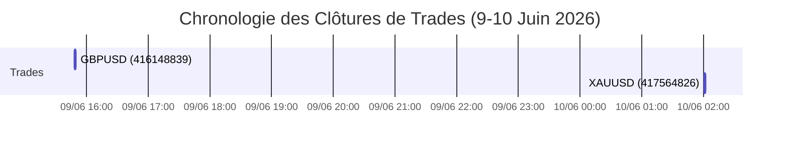

# Rapport d'Audit de Trading Quotidien - 10 Juin 2026

Ce rapport présente l'analyse exhaustive de l'activité de trading pour la journée du **10 Juin 2026**, tout en incluant le trade du **9 Juin 2026** afin de couvrir l'intégralité des 3 derniers trades exécutés par le bot. Il évalue les performances, analyse la cohérence technique des décisions prises par l'IA (DeepSeek) et propose des optimisations concrètes pour le code et la stratégie.

---

## 1. Résumé des Performances

Voici les métriques clés de performance calculées pour la journée du **10 Juin 2026** (et la période cumulée des 3 derniers trades) :

| Métrique | Valeur (10 Juin 2026) | Valeur Cumulée (9-10 Juin) |
| :--- | :--- | :--- |
| **Nombre total de trades** | 2 (1 clôturé, 1 en cours) | 3 (2 clôturés, 1 en cours) |
| **Trades gagnants (Closed)** | 1 | 2 |
| **Trades perdants (Closed)** | 0 | 0 |
| **Taux de réussite (Win Rate)** | **100.0 %** | **100.0 %** |
| **PnL Réalisé (Clôturé)** | **+29.63 USD** (XAUUSD) | **+37.09 USD** |
| **PnL Flottant (En cours)** | **-1.82 USD** (AUDUSD) | **-1.82 USD** |
| **Drawdown max estimé** | **0.00 USD** | **0.00 USD** |

> [!NOTE]
> La performance sur cette période est excellente avec 100% de réussite sur les positions clôturées, portée principalement par un trade de grande précision sur l'or (XAUUSD).

---

## 2. Tableau Récapitulatif des Trades

| Ticket | Symbole | Direction | Volume | Prix Ouv. | Prix Clôt. | SL | TP | PnL (USD) | Raison Clôt. | Commentaire / Raisonnement IA |
| :--- | :--- | :--- | :--- | :--- | :--- | :--- | :--- | :--- | :--- | :--- |
| **416148839** | GBPUSD | BUY | 0.03 | 1.33740 | 1.34030 | 1.33380 | 1.34460 | +7.46 | EXPERT | Signaux M15 haussiers (EMA, MACD, RSI, Ichimoku). SL placé sous le nuage (1.33380). TP R3 visé. Sortie temporelle. |
| **417561655** | AUDUSD | SELL | 0.06 | 0.70216 | *En cours* | 0.70406 | 0.69726 | *-1.82* | *Ouvert* | Indicateurs baissiers (RSI 37, MACD < 0, sous EMA/nuage). SL au-dessus du nuage, TP proche de S2. |
| **417564826** | XAUUSD | SELL | 0.01 | 4246.48 | 4212.28 | 4262.88 | 4212.28 | +29.63 | TP | Convergence baissière forte, figure en étoile du soir, rupture du swing low. SL au-dessus du swing high. TP touché. |

---

## 3. Évolution du PnL Cumulé (Mermaid)

### Chronologie des Clôtures (9-10 Juin)


### Courbe du PnL Cumulé
```mermaid
xychart-beta
    title "Évolution du PnL Cumulé (USD)"
    x-axis [Départ, GBPUSD (09/06), XAUUSD (10/06)]
    y-axis [0, 40]
    line [0, 7.46, 37.09]
```

---

## 4. Analyse Technique & Critique de Cohérence (DeepSeek vs Exécution)

### 4.1. GBPUSD (Ticket 416148839 | Achat)
*   **Analyse de cohérence du SL/TP** :
    *   L'IA a proposé un SL à `1.33380`, sous le bas du nuage Ichimoku (`1.33411`). C'est un placement structurel parfaitement cohérent et sécurisé.
    *   Cependant, l'IA a explicitement suggéré un TP sous le point pivot R3 à `1.34330` (59 pips de gain).
    *   Le code de la stratégie a quant à lui soumis un TP à `1.34460` (72 pips). Pourquoi ? Le SL étant de 36 pips, le code a forcé un ratio de risque/récompense (R:R) rigide de **2.0** (`36 * 2 = 72 pips`).
*   **Alerte Critique** : Forcer un ratio R:R mathématique fixe a poussé le TP *au-dessus* de la résistance majeure R3 (`1.34343`). Placer un TP au-dessus de R3 réduit significativement les chances d'exécution en cas de retournement sur niveau clé. Heureusement, le trade a été clôturé avec profit (`+7.46 USD`) grâce à la règle de sortie temporelle de l'Expert à `1.34030`, mais cette rigidité du code constitue un risque.
*   **Indicateur non confirmé** : L'IA a mentionné un alignement haussier des moyennes mobiles (`EMA20/200`). Or, l'indicateur `ema_20` était à `1.33624` and `ema_200` à `1.33632`. L'EMA20 était donc encore légèrement sous l'EMA200. Bien que le prix fût au-dessus des deux moyennes, le croisement officiel (Golden Cross) n'était pas validé.

### 4.2. AUDUSD (Ticket 417561655 | Vente | En cours)
*   **Analyse de cohérence du SL/TP** :
    *   SL placé à `0.70406` (ajusté avec le spread/slippage sur la base de la proposition IA à `0.70390`), au-dessus du nuage Ichimoku (`0.70380`) et proche de l'EMA200 (`0.70408`). Le positionnement est cohérent avec la structure.
    *   TP à `0.69726` (proposé à `0.69711`), juste au-dessus du support S2 (`0.69691`).
*   **Hallucination de calcul temporel** : 
    *   L'IA justifie l'absence de blocage macroéconomique en déclarant : *"Prochain news [MED] AUD dans 2h30"*.
    *   Or, la news (Indice NAB de confiance des entreprises) était planifiée à `01:30` UTC. Le trade ayant été ouvert à `01:03:37` UTC, l'événement était dans seulement **26 minutes**.
    *   *Impact* : La news étant d'impact moyen (MEDIUM), elle ne bloquait pas l'ouverture selon les règles de risque actuelles (qui ne bloquent que pour les news HIGH à moins de 30 min). Néanmoins, cette erreur montre une faiblesse de l'IA dans la soustraction et l'interprétation des fuseaux horaires des événements économiques.

### 4.3. XAUUSD (Ticket 417564826 | Vente | Clôturé TP)
*   **Analyse de cohérence du SL/TP** :
    *   L'IA a identifié avec précision le dernier swing high à `4262.08` et a suggéré un SL juste au-dessus à `4262.08` (exécuté à `4262.88` en raison de la marge de spread).
    *   Le TP a été placé à `4212.28` (visant le support S1 à `4209.75` + 2 pips).
    *   Cette configuration offrait un excellent ratio R:R de **2.09**.
*   **Appréciation** : Une exécution parfaite. L'IA a correctement analysé la figure en étoile du soir sur l'unité de temps et la cassure de la structure de prix (swing low). Le trade a atteint son objectif rapidement, sécurisant un profit important de `+29.63 USD`.

---

## 5. Alertes de Debug et Pistes d'Optimisation

### 5.1. Alerte : Écrasement des TP techniques par le code
> [!WARNING]
> Le code de gestion de la stratégie écrase ou ajuste les niveaux de Take Profit recommandés par l'IA pour appliquer un ratio R:R fixe. Bien que cela protège l'espérance mathématique, cela peut placer des objectifs au-delà de barrières techniques majeures (comme la résistance R3 sur GBPUSD), empêchant le TP d'être touché.
*   **Solution proposée** : Modifier le code de calcul des SL/TP dans `strategy.py` pour qu'il compare le TP mathématique (basé sur le R:R fixe ou l'ATR) avec les niveaux de support/résistance identifiés par l'IA. Si le TP mathématique dépasse un pivot majeur (R2/R3 pour un achat, S2/S3 pour une vente), le code doit ajuster le TP juste en deçà de cette barrière pour maximiser la probabilité de succès.

### 5.2. Alerte : Hallucination de temps sur le calendrier économique
> [!IMPORTANT]
> L'IA a des difficultés à évaluer précisément le délai restant avant une annonce économique à partir de chaînes de caractères brutes. Une erreur sur une annonce à fort impact (HIGH) pourrait amener le bot à initier un trade quelques minutes seulement avant un pic de volatilité majeur.
*   **Solution proposée** : Au lieu de transmettre les heures brutes des événements à l'IA et de la laisser calculer le délai, le script d'extraction du calendrier dans `calendar.py` doit calculer programmatiquement le nombre de minutes restantes avant chaque événement (ex: `minutes_remaining: 26`). Cette donnée numérique brute doit être explicitement injectée dans le prompt pour éliminer toute erreur de calcul temporel de la part de l'IA.

### 5.3. Recommandation : Suivi actif de la position AUDUSD
*   Le trade AUDUSD (Ticket `417561655`) est actuellement en cours et affiche une légère perte latente de `-3.5 pips` (`-1.82 USD`). 
*   La structure restant baissière sous le nuage Ichimoku, il convient de maintenir la position ouverte. S'assurer que les fonctions de gestion de position (Trailing Stop et Breakeven) sont prêtes à s'enclencher dès que le P&L passera positif.
